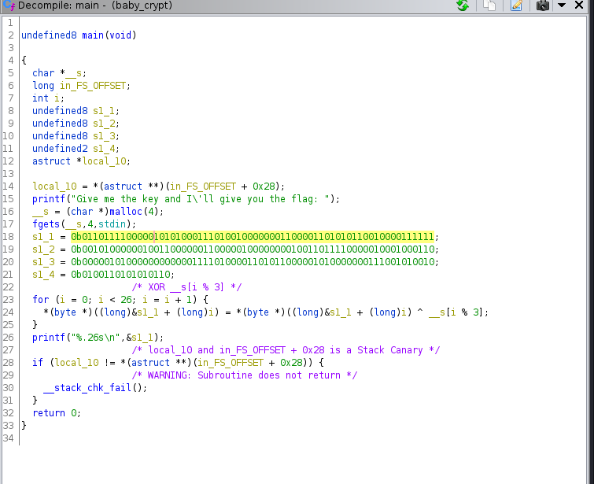

Raw notes in here.  
Raw data in [data_dumps](data_dumps.md).

# <Challenge Name>

# Notes
Bread Crumbs  
[Sample link](#helpful-resources)

# Ghidra

## Decompiled (Dirty)
```c
undefined8 main(void)

{
  char *__s;
  long in_FS_OFFSET;
  int local_44;
  undefined8 local_38;
  undefined8 local_30;
  undefined8 local_28;
  undefined2 local_20;
  long local_10;
  
  local_10 = *(long *)(in_FS_OFFSET + 0x28);
  printf("Give me the key and I\'ll give you the flag: ");
  __s = (char *)malloc(4);
  fgets(__s,4,stdin);
  local_38 = 0x6f0547480c35643f;
  local_30 = 0x28130304026f0446;
  local_28 = 0x5000f4358280e52;
  local_20 = 0x4d56;
  for (local_44 = 0; local_44 < 0x1a; local_44 = local_44 + 1) {
    *(byte *)((long)&local_38 + (long)local_44) =
         *(byte *)((long)&local_38 + (long)local_44) ^ __s[local_44 % 3];
  }
  printf("%.26s\n",&local_38);
  if (local_10 != *(long *)(in_FS_OFFSET + 0x28)) {
                    /* WARNING: Subroutine does not return */
    __stack_chk_fail();
  }
  return 0;
}
```

## Decompiled (Tweaked)


//changed to binary



## Key
We know the part of the plaintext which is HTB{foo}  
We also know that the ^XOR operation is using the only the first 3 chars of the user input because of "^ __s[i % 3]"
```
└─# ./baby_crypt 
Give me the key and I'll give you the flag: HTB{
w0wDM;L;@LWQ`L`                                     //Grab the first 3 chars
               GTG

└─# ./baby_crypt
Give me the key and I'll give you the flag: w0wAAAA     //AAAA is meaningless here, only w0w is iterated over
HTB{x0r_1s_us3d_by_h4x0r!}
```

# Helpful Resources
https://hackernoon.com/the-reason-xor-is-so-special-in-cryptography

# TODO
//What is?
```
    00101241 48 63 c1                  MOVSXD     RAX,ECX
    00101244 48 69 c0 56 55 55 55      IMUL       RAX,RAX,0x55555556
    0010124b 48 c1 e8 20               SHR        RAX,0x20
    0010124f 48 89 c2                  MOV        RDX,RAX
    00101252 89 c8                     MOV        EAX,ECX
    00101254 c1 f8 1f                  SAR        EAX,0x1f
    00101257 29 c2                     SUB        EDX,EAX
    00101259 89 d0                     MOV        EAX,EDX
    0010125b 01 c0                     ADD        EAX,EAX
    0010125d 01 d0                     ADD        EAX,EDX
    0010125f 29 c1                     SUB        ECX,EAX
    00101261 89 ca                     MOV        EDX,ECX
    00101263 48 63 d2                  MOVSXD     RDX,EDX
```

# TAGS: <Anything Unique> <technique> <defenses> <origin>  <category>
