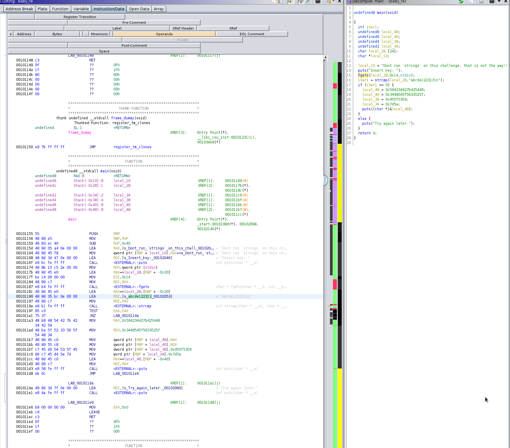
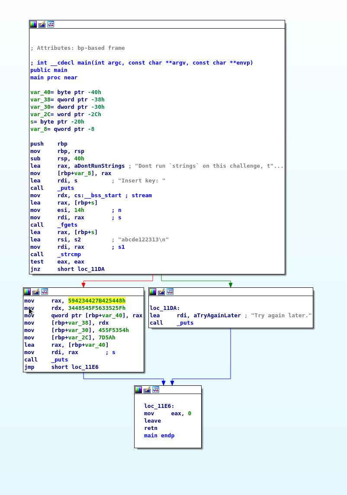
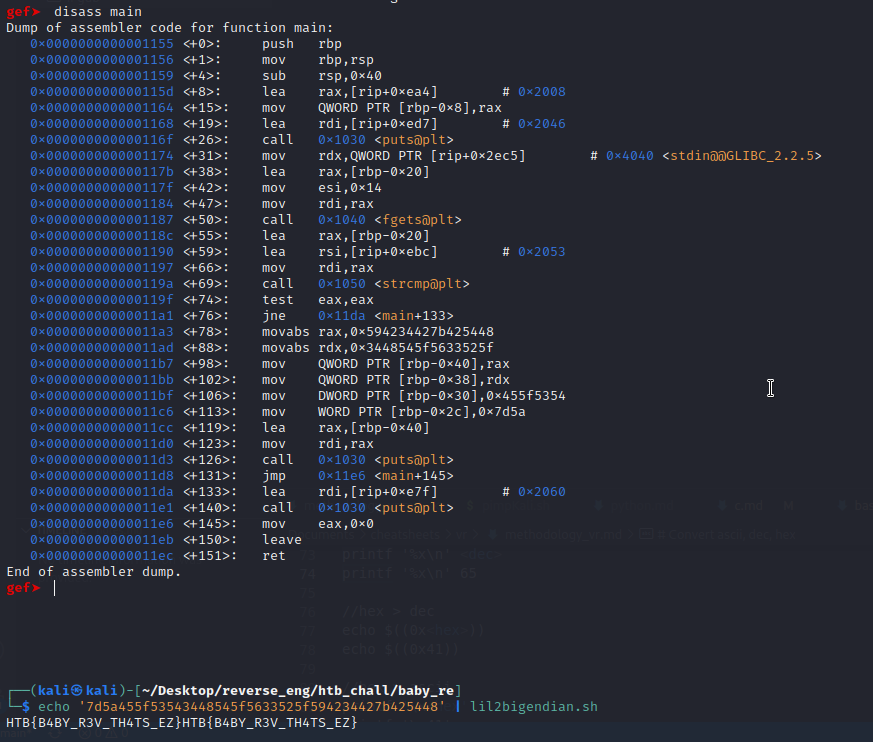

Raw notes

# Baby
strcmp to hardcoded string, can also extract hex values and convert to ASCII

## Key
```
└─# ./baby_re  
Insert key:  
abcde122313  
HTB{B4BY_R3V_TH4TS_EZ}
```

# Ghidra


# IDA


# gdb
//script used  
https://github.com/Kyzen-gmg/scripts/blob/master/lil2bigendian.sh



# TODO
How did string get mangled?
```
└─# strings baby_re | grep HTB -A 2
HTB{B4BYH
_R3V_TH4H
TS_Ef       //anomaly, how?
```