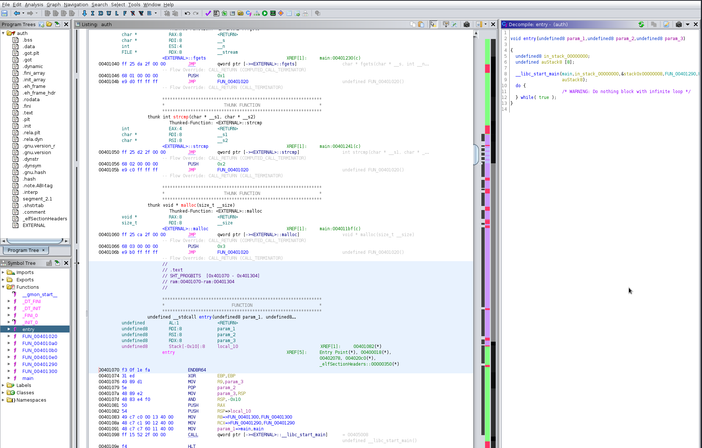
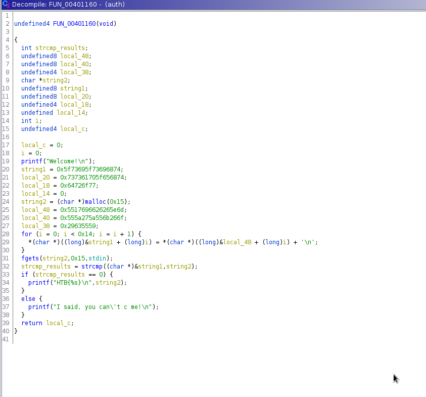
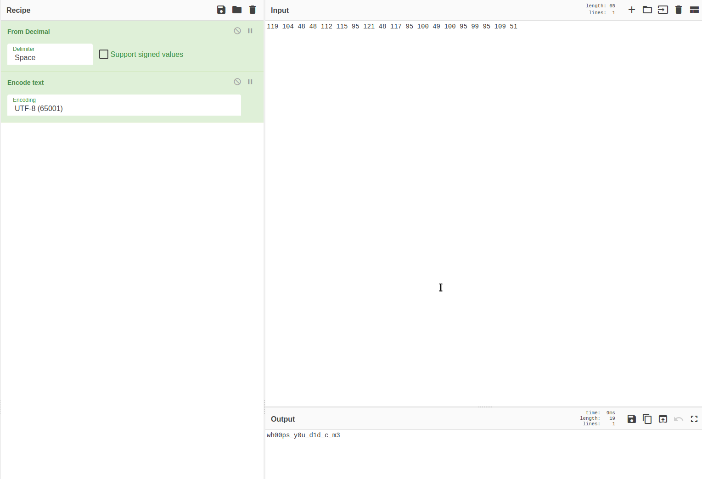
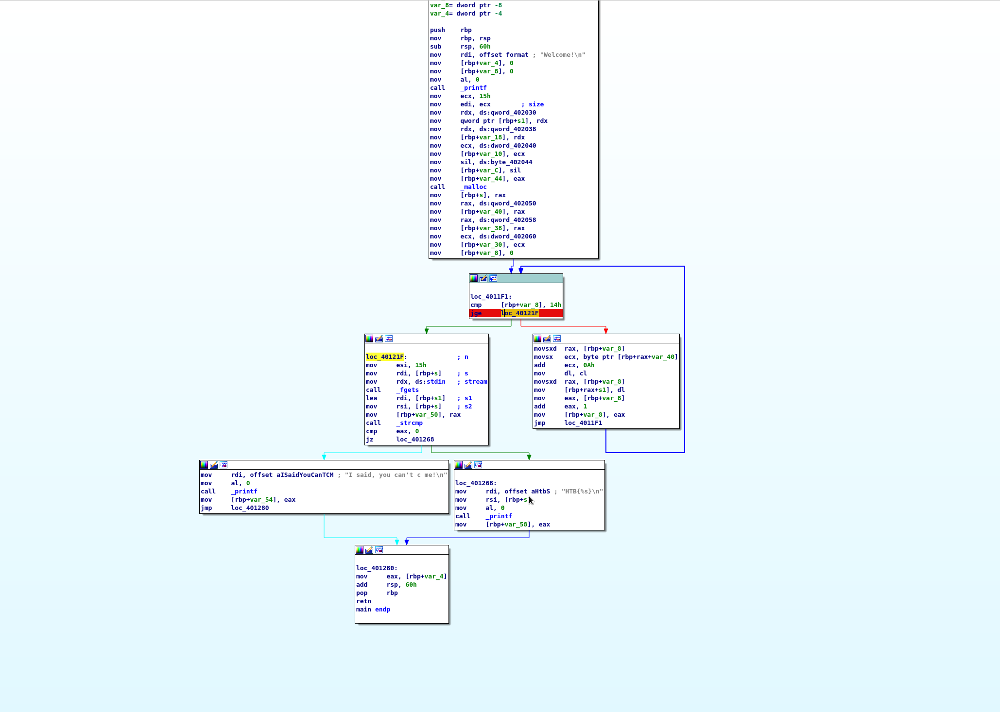

Raw notes

# You Cant C Me

## Key
```
└─# ./auth
Welcome!
wh00ps!_y0u_d1d_c_m3     
HTB{wh00ps!_y0u_d1d_c_m3}
```

# ltrace
//
```
//stripped
└─# file auth               
auth: ELF 64-bit LSB executable, x86-64, version 1 (SYSV), dynamically linked, interpreter /lib64/ld-linux-x86-64.so.2, for GNU/Linux 3.2.0, stripped

//ltrace finds strcmp("wh00ps!_y0u_d1d_c_m3")
└─# ltrace ./auth
printf("Welcome!\n"Welcome!
)                                                                                                                                                 = 9
malloc(21)                                                                                                                                                           = 0x15ca6b0
fgets(AAAA
"AAAA\n", 21, 0x7fc97dbf89a0)                                                                                                                                  = 0x15ca6b0
strcmp("wh00ps!_y0u_d1d_c_m3", "AAAA\n")                                                                                                                             = 54
printf("I said, you can't c me!\n"I said, you can't c me!
)                                                                                                                                  = 24
+++ exited (status 0) +++
```

# Ghidra
//Checked entry, renamed '__libc_start_main(FUN_00401160' into '__libc_start_main(main'


//cleaned up decompiled output


//line 29 is tough to decipher; string found in local_48
```
└─# echo "m^&&fiUo&kUZ'ZUYUc)" | ascii2dec.sh 
109 94 38 38 102 105 85 111 38 107 85 90 39 90 85 89 85 99 41  
```
//added 10  
119 104 48 48 112 115 95 121 48 117 95 100 49 100 95 99 95 109 51  

//cyberchef


# IDA


# gdb


# Helpful Resources
https://www.youtube.com/watch?v=opyxln4dlJs&list=PLeSXUd883dhhKcvS2RSN500Bz2BDeTgqy&index=2