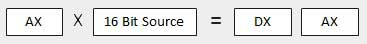

# Main Resources
https://www.tutorialspoint.com/assembly_programming/index.htm

## Supplemental Resources
foo

# Introduction
https://www.tutorialspoint.com/assembly_programming/assembly_introduction.htm

## Addressing Data in Memory
The process through which the processor controls the execution of instructions is referred as the fetch-decode-execute cycle or the execution cycle. It consists of three continuous steps −

- Fetching the instruction from memory
- Decoding or identifying the instruction
- Executing the instruction

The processor may access one or more bytes of memory at a time. Let us consider a hexadecimal number 0725H. This number will require two bytes of memory. The high-order byte or most significant byte is 07 and the low-order byte is 25.

The processor stores data in reverse-byte sequence, i.e., a low-order byte is stored in a low memory address and a high-order byte in high memory address. So, if the processor brings the value 0725H from register to memory, it will transfer 25 first to the lower memory address and 07 to the next memory address.

  
x: memory address

When the processor gets the numeric data from memory to register, it again reverses the bytes. There are two kinds of memory addresses −

Absolute address - a direct reference of specific location.

Segment address (or offset) - starting address of a memory segment with the offset value.

# Basic Syntax
An assembly program can be divided into three sections −

- The data section,
- The bss section, and
- The text section.

## The data Section
The data section is used for declaring initialized data or constants. This data does not change at runtime. You can declare various constant values, file names, or buffer size, etc., in this section.

The syntax for declaring data section is −
```
section.data
```

## The bss Section
The bss section is used for declaring variables. The syntax for declaring bss section is −
```
section.bss
```

## The text section
The text section is used for keeping the actual code. This section must begin with the declaration global _start, which tells the kernel where the program execution begins.

The syntax for declaring text section is −
```
section.text
global _start
_start:
```

## Comments
Assembly language comment begins with a semicolon (;). It may contain any printable character including blank. It can appear on a line by itself, like −
```
; This program displays a message on screen
```
or, on the same line along with an instruction, like −
```
add eax, ebx     ; adds ebx to eax
```

## Assembly Language Statements
Assembly language programs consist of three types of statements −

- Executable instructions or instructions,
- Assembler directives or pseudo-ops, and
- Macros.
The executable instructions or simply instructions tell the processor what to do. Each instruction consists of an operation code (opcode). Each executable instruction generates one machine language instruction.

The assembler directives or pseudo-ops tell the assembler about the various aspects of the assembly process. These are non-executable and do not generate machine language instructions.

Macros are basically a text substitution mechanism.

## Syntax of Assembly Language Statements
Assembly language statements are entered one statement per line. Each statement follows the following format −
```
[label] mnemonic [operands] [;comment]
```
The fields in the square brackets are optional. A basic instruction has two parts, the first one is the name of the instruction (or the mnemonic), which is to be executed, and the second are the operands or the parameters of the command.

Following are some examples of typical assembly language statements −
```
INC COUNT ; Increment the memory variable COUNT

MOV TOTAL, 48 ; Transfer the value 48 in the
; memory variable TOTAL

ADD AH, BH ; Add the content of the
; BH register into the AH register

AND MASK1, 128 ; Perform AND operation on the
; variable MASK1 and 128

ADD MARKS, 10 ; Add 10 to the variable MARKS
MOV AL, 10 ; Transfer the value 10 to the AL register
```
Compiling and Linking an Assembly Program in NASM
Make sure you have set the path of nasm and ld binaries in your PATH environment variable. Now, take the following steps for compiling and linking the above program −

Type the above code using a text editor and save it as hello.asm.

Make sure that you are in the same directory as where you saved hello.asm.

To assemble the program, type nasm -f elf hello.asm

If there is any error, you will be prompted about that at this stage. Otherwise, an object file of your program named hello.o will be created.

To link the object file and create an executable file named hello, type ld -m elf_i386 -s -o hello hello.o

Execute the program by typing ./hello

If you have done everything correctly, it will display 'Hello, world!' on the screen.

# Memory Segments
We have already discussed the three sections of an assembly program. These sections represent various memory segments as well.

Interestingly, if you replace the section keyword with segment, you will get the same result. Try the following code −
```
segment .text           ;code segment
    global _start       ;must be declared for linker

_start:                 ;tell linker entry point
    mov edx,len         ;message length
    mov ecx,msg         ;message to write
    mov ebx,1           ;file descriptor (stdout)
    mov eax,4           ;syscall number (sys_write)
    int 0x80            ;call kernel

    mov eax,1           ;syscall number (sys_exit)
    int 0x80            ;call kernel

sgement .data           ;data segment
msg db 'Hello, world!',0xa      ;our dear string
len equ $ - msg         ;length of our dear string
```
## Memory Segments
A segmented memory model divides the system memory into groups of independent segments referenced by pointers located in the segment registers. Each segment is used to contain a specific type of data. One segment is used to contain instruction codes, another segment stores the data elements, and a third segment keeps the program stack.

In the light of the above discussion, we can specify various memory segments as −

**Data segment** − It is represented by **.data** section and the **.bss.**  
The .data section is used to declare the memory region, where data elements are stored for the program. ***This section cannot be expanded after the data elements are declared, and it remains static throughout the program.***

The .bss section is also a static memory section that contains buffers for data to be declared later in the program. This buffer memory is zero-filled.

**Code segment** − It is represented by **.text** section. This defines an area in memory that stores the instruction codes. This is also a fixed area.

**Stack** − This segment contains data values passed to functions and procedures within the program.

# Registers
Processor operations mostly involve processing data. This data can be stored in memory and accessed from thereon. However, reading data from and storing data into memory slows down the processor, as it involves complicated processes of sending the data request across the control bus and into the memory storage unit and getting the data through the same channel.

To speed up the processor operations, the processor includes some internal memory storage locations, called registers.

The registers store data elements for processing without having to access the memory. A limited number of registers are built into the processor chip.

## Processor Registers
There are ten 32-bit and six 16-bit processor registers in IA-32 architecture. The registers are grouped into three categories −

General registers,
Control registers, and
Segment registers.
The general registers are further divided into the following groups −

Data registers,
Pointer registers, and
Index registers.

## Data Registers
Four 32-bit data registers are used for arithmetic, logical, and other operations. These 32-bit registers can be used in three ways −

As complete 32-bit data registers: EAX, EBX, ECX, EDX.

Lower halves of the 32-bit registers can be used as four 16-bit data registers: AX, BX, CX and DX.

Lower and higher halves of the above-mentioned four 16-bit registers can be used as eight 8-bit data registers: AH, AL, BH, BL, CH, CL, DH, and DL.


Some of these data registers have specific use in arithmetical operations.

**AX is the primary accumulator**; it is used in input/output and most arithmetic instructions. For example, in multiplication operation, one operand is stored in EAX or AX or AL register according to the size of the operand.

**BX is known as the base register**, as it could be used in indexed addressing.

**CX is known as the count register**, as the ECX, CX registers store the loop count in iterative operations.

**DX is known as the data register**. It is also used in input/output operations. It is also used with AX register along with DX for multiply and divide operations involving large values.

## Pointer Registers
The pointer registers are 32-bit EIP, ESP, and EBP registers and corresponding 16-bit right portions IP, SP, and BP. There are three categories of pointer registers −

**Instruction Pointer (IP)** − The 16-bit IP register stores the offset address of the next instruction to be executed. IP in association with the CS register (as CS:IP) gives the complete address of the current instruction in the code segment.

**Stack Pointer (SP)** − The 16-bit SP register provides the offset value within the program stack. SP in association with the SS register (SS:SP) refers to be current position of data or address within the program stack.

**Base Pointer (BP)** − The 16-bit BP register mainly helps in referencing the parameter variables passed to a subroutine. The address in SS register is combined with the offset in BP to get the location of the parameter. BP can also be combined with DI and SI as base register for special addressing.


## Index Registers
The 32-bit index registers, ESI and EDI, and their 16-bit rightmost portions. SI and DI, are used for indexed addressing and sometimes used in addition and subtraction. There are two sets of index pointers −

- **Source Index (SI)** − It is used as source index for string operations.

- **Destination Index (DI)** − It is used as destination index for string operations.


## Control Registers
The 32-bit instruction pointer register and the 32-bit flags register combined are considered as the control registers.

Many instructions involve comparisons and mathematical calculations and change the status of the flags and some other conditional instructions test the value of these status flags to take the control flow to other location.

The common flag bits are:

**Overflow Flag (OF)** − It indicates the overflow of a high-order bit (leftmost bit) of data after a signed arithmetic operation.

**Direction Flag (DF)** − It determines left or right direction for moving or comparing string data. When the DF value is 0, the string operation takes left-to-right direction and when the value is set to 1, the string operation takes right-to-left direction.

**Interrupt Flag (IF)** − It determines whether the external interrupts like keyboard entry, etc., are to be ignored or processed. It disables the external interrupt when the value is 0 and enables interrupts when set to 1.

**Trap Flag (TF)** − It allows setting the operation of the processor in single-step mode. The DEBUG program we used sets the trap flag, so we could step through the execution one instruction at a time.

**Sign Flag (SF)** − It shows the sign of the result of an arithmetic operation. This flag is set according to the sign of a data item following the arithmetic operation. The sign is indicated by the high-order of leftmost bit. A positive result clears the value of SF to 0 and negative result sets it to 1.

**Zero Flag (ZF)** − It indicates the result of an arithmetic or comparison operation. A nonzero result clears the zero flag to 0, and a zero result sets it to 1.

**Auxiliary Carry Flag (AF)** − It contains the carry from bit 3 to bit 4 following an arithmetic operation; used for specialized arithmetic. The AF is set when a 1-byte arithmetic operation causes a carry from bit 3 into bit 4.

**Parity Flag (PF)** − It indicates the total number of 1-bits in the result obtained from an arithmetic operation. An even number of 1-bits clears the parity flag to 0 and an odd number of 1-bits sets the parity flag to 1.

**Carry Flag (CF)** − It contains the carry of 0 or 1 from a high-order bit (leftmost) after an arithmetic operation. It also stores the contents of last bit of a shift or rotate operation.

The following table indicates the position of flag bits in the 16-bit Flags register:
```
Flag:					O	D	I	T	S	Z		A		P		C
Bit no:	15	14	13	12	11	10	9	8	7	6	5	4	3	2	1	0
```

## Segment Registers
Segments are specific areas defined in a program for containing data, code and stack. There are three main segments −

**Code Segment** − It contains all the instructions to be executed. A 16-bit Code Segment register or CS register stores the starting address of the code segment.

**Data Segment** − It contains data, constants and work areas. A 16-bit Data Segment register or DS register stores the starting address of the data segment.

**Stack Segment** − It contains data and return addresses of procedures or subroutines. It is implemented as a 'stack' data structure. The Stack Segment register or SS register stores the starting address of the stack.

Apart from the DS, CS and SS registers, there are other extra segment registers - ES (extra segment), FS and GS, which provide additional segments for storing data.

In assembly programming, a program needs to access the memory locations. All memory locations within a segment are relative to the starting address of the segment. A segment begins in an address evenly divisible by 16 or hexadecimal 10. So, the rightmost hex digit in all such memory addresses is 0, which is not generally stored in the segment registers.

The segment registers stores the starting addresses of a segment. To get the exact location of data or instruction within a segment, an offset value (or displacement) is required. To reference any memory location in a segment, the processor combines the segment address in the segment register with the offset value of the location.

# System Calls
You can make use of Linux system calls in your assembly programs. You need to take the following steps for using Linux system calls in your program −

Put the system call number in the EAX register.
Store the arguments to the system call in the registers EBX, ECX, etc.
Call the relevant interrupt (80h).
The result is usually returned in the EAX register.
There are six registers that store the arguments of the system call used. These are the EBX, ECX, EDX, ESI, EDI, and EBP. These registers take the consecutive arguments, starting with the EBX register. If there are more than six arguments, then the memory location of the first argument is stored in the EBX register.

The following code snippet shows the use of the system call sys_exit −
```
mov	eax,1		; system call number (sys_exit)
int	0x80		; call kernel
The following code snippet shows the use of the system call sys_write −

mov	edx,4		; message length
mov	ecx,msg		; message to write
mov	ebx,1		; file descriptor (stdout)
mov	eax,4		; system call number (sys_write)
int	0x80		; call kernel
All the syscalls are listed in /usr/include/asm/unistd.h, together with their numbers (the value to put in EAX before you call int 80h).
```
The following table shows some of the system calls used in this tutorial −
```
%eax	Name	    %ebx	        %ecx	        %edx	%esx	%edi
1	    sys_exit	int             -	            -	    -	    -
2	    sys_fork	struct pt_regs	-	            -	    -	    -
3	    sys_read	unsigned int	char *	        size_t	-	    -
4	    sys_write	unsigned int	const char *	size_t	-	    -
5	    sys_open	const char *	int	            int	    -	    -
6	    sys_close	unsigned int	-	            -	    -	    -
```

# Addressing Modes
Most assembly language instructions require operands to be processed. An operand address provides the location, where the data to be processed is stored. Some instructions do not require an operand, whereas some other instructions may require one, two, or three operands.

When an instruction requires two operands, the first operand is generally the destination, which contains data in a register or memory location and the second operand is the source. Source contains either the data to be delivered (immediate addressing) or the address (in register or memory) of the data. Generally, the source data remains unaltered after the operation.

The three basic modes of addressing are −

- Register addressing
- Immediate addressing
- Memory addressing

## Register Addressing
In this addressing mode, a register contains the operand. Depending upon the instruction, the register may be the first operand, the second operand or both.

For example,
```nasm
MOV DX, TAX_RATE   ; Register in first operand
MOV COUNT, CX	   ; Register in second operand
MOV EAX, EBX	   ; Both the operands are in registers
```
As processing data between registers does not involve memory, it provides fastest processing of data.

## Immediate Addressing
An immediate operand has a constant value or an expression. When an instruction with two operands uses immediate addressing, the first operand may be a register or memory location, and the second operand is an immediate constant. The first operand defines the length of the data.

For example,
```nasm
BYTE_VALUE  DB  150    ; A byte value is defined
WORD_VALUE  DW  300    ; A word value is defined
ADD  BYTE_VALUE, 65    ; An immediate operand 65 is added
MOV  AX, 45H           ; Immediate constant 45H is transferred to AX
```

## Direct Memory Addressing
When operands are specified in memory addressing mode, direct access to main memory, usually to the data segment, is required. This way of addressing results in slower processing of data. To locate the exact location of data in memory, we need the segment start address, which is typically found in the DS register and an offset value. This offset value is also called effective address.

In direct addressing mode, the offset value is specified directly as part of the instruction, usually indicated by the variable name. The assembler calculates the offset value and maintains a symbol table, which stores the offset values of all the variables used in the program.

In direct memory addressing, one of the operands refers to a memory location and the other operand references a register.

For example,
```nasm
ADD	BYTE_VALUE, DL	; Adds the register in the memory location
MOV	BX, WORD_VALUE	; Operand from the memory is added to register
```

# Variables
NASM provides various define directives for reserving storage space for variables. The define assembler directive is used for allocation of storage space. It can be used to reserve as well as initialize one or more bytes.
Allocating Storage Space for Initialized Data

The syntax for storage allocation statement for initialized data is −
```
[variable-name]    define-directive    initial-value   [,initial-value]...
```
Where, variable-name is the identifier for each storage space. The assembler associates an offset value for each variable name defined in the data segment.

There are five basic forms of the define directive −
```
Directive 	Purpose 	            Storage Space
DB 	        Define Byte 	        allocates 1 byte
DW 	        Define Word 	        allocates 2 bytes
DD 	        Define Doubleword 	    allocates 4 bytes
DQ 	        Define Quadword 	    allocates 8 bytes
DT 	        Define Ten Bytes 	    allocates 10 bytes
```
Following are some examples of using define directives −
```
choice		    DB	'y'
number		    DW	12345
neg_number	    DW	-12345
big_number	    DQ	123456789
real_number1	DD	1.234
real_number2	DQ	123.456
```
Please note that −

    Each byte of character is stored as its ASCII value in hexadecimal.

    Each decimal value is automatically converted to its 16-bit binary equivalent and stored as a hexadecimal number.

    Processor uses the little-endian byte ordering.

    Negative numbers are converted to its 2's complement representation.

    Short and long floating-point numbers are represented using 32 or 64 bits, respectively.

The following program shows the use of define directive −
```nasm
section .text
   global _start          ;must be declared for linker (gcc)
	
_start:                   ;tell linker entry point
   mov	edx,1		  ;message length
   mov	ecx,choice        ;message to write
   mov	ebx,1		  ;file descriptor (stdout)
   mov	eax,4		  ;system call number (sys_write)
   int	0x80		  ;call kernel

   mov	eax,1		  ;system call number (sys_exit)
   int	0x80		  ;call kernel

section .data
choice DB 'y'
```
When the above code is compiled and executed, it produces the following result −
```
y
```

## Allocating Storage Space for Uninitialized Data

The reserve directives are used for reserving space for uninitialized data. The reserve directives take a single operand that specifies the number of units of space to be reserved. Each define directive has a related reserve directive.

There are five basic forms of the reserve directive −
```
Directive 	Purpose
RESB 	    Reserve a Byte
RESW 	    Reserve a Word
RESD 	    Reserve a Doubleword
RESQ 	    Reserve a Quadword
REST 	    Reserve a Ten Bytes
```

## Multiple Definitions

You can have multiple data definition statements in a program. For example −
```nasm
choice	   DB     'Y' 	    ;ASCII of y = 79H
number1	   DW    12345 	    ;12345D = 3039H
number2    DD   12345679    ;123456789D = 75BCD15H
```
The assembler allocates contiguous memory for multiple variable definitions.
Multiple Initializations

The TIMES directive allows multiple initializations to the same value. For example, an array named marks of size 9 can be defined and initialized to zero using the following statement −
```nasm
marks  TIMES  9  DW  0
```
The TIMES directive is useful in defining arrays and tables. The following program displays 9 asterisks on the screen −
```nasm
section	.text
   global _start        ;must be declared for linker (ld)
	
_start:                 ;tell linker entry point
   mov	edx,9		;message length
   mov	ecx, stars	;message to write
   mov	ebx,1		;file descriptor (stdout)
   mov	eax,4		;system call number (sys_write)
   int	0x80		;call kernel

   mov	eax,1		;system call number (sys_exit)
   int	0x80		;call kernel

section	.data
stars   times 9 db '*'
```
When the above code is compiled and executed, it produces the following result −
```
*********
```

# Constants
There are several directives provided by NASM that define constants. We have already used the EQU directive in previous chapters. We will particularly discuss three directives −
```nasm
    EQU
    %assign
    %define
```

## The EQU Directive

The EQU directive is used for defining constants. The syntax of the EQU directive is as follows −
```
CONSTANT_NAME EQU expression
```
For example,
```
TOTAL_STUDENTS equ 50
```
You can then use this constant value in your code, like −
```nasm
mov  ecx,  TOTAL_STUDENTS 
cmp  eax,  TOTAL_STUDENTS
```
The operand of an EQU statement can be an expression −
```nasm
LENGTH equ 20
WIDTH  equ 10
AREA   equ length * width
```
Above code segment would define AREA as 200.

## Example
The following example illustrates the use of the EQU directive −
```nasm
SYS_EXIT  equ 1
SYS_WRITE equ 4
STDIN     equ 0
STDOUT    equ 1
section	 .text
   global _start    ;must be declared for using gcc
	
_start:             ;tell linker entry point
   mov eax, SYS_WRITE         
   mov ebx, STDOUT         
   mov ecx, msg1         
   mov edx, len1 
   int 0x80                
	
   mov eax, SYS_WRITE         
   mov ebx, STDOUT         
   mov ecx, msg2         
   mov edx, len2 
   int 0x80 
	
   mov eax, SYS_WRITE         
   mov ebx, STDOUT         
   mov ecx, msg3         
   mov edx, len3 
   int 0x80
   
   mov eax,SYS_EXIT    ;system call number (sys_exit)
   int 0x80            ;call kernel

section	 .data
msg1 db	'Hello, programmers!',0xA,0xD 	
len1 equ $ - msg1			

msg2 db 'Welcome to the world of,', 0xA,0xD 
len2 equ $ - msg2 

msg3 db 'Linux assembly programming! '
len3 equ $- msg3
```
When the above code is compiled and executed, it produces the following result −
```
Hello, programmers!
Welcome to the world of,
Linux assembly programming!
```

## The %assign Directive
The %assign directive can be used to define numeric constants like the EQU directive. This directive allows redefinition. For example, you may define the constant TOTAL as −
```
%assign TOTAL 10
```
Later in the code, you can redefine it as −
```
%assign  TOTAL  20
```
This directive is case-sensitive.
The %define Directive

The %define directive allows defining both numeric and string constants. This directive is similar to the #define in C. For example, you may define the constant PTR as −
```
%define PTR [EBP+4]
```
The above code replaces PTR by [EBP+4].

This directive also allows redefinition and it is case-sensitive.

# Arithmetic Instructions

## The INC Instruction
The INC instruction is used for incrementing an operand by one. It works on a single operand that can be either in a register or in memory.
Syntax

The INC instruction has the following syntax −
```
INC destination
```
The operand destination could be an 8-bit, 16-bit or 32-bit operand.
Example
```nasm
INC EBX	     ; Increments 32-bit register
INC DL       ; Increments 8-bit register
INC [count]  ; Increments the count variable
```

## The DEC Instruction

The DEC instruction is used for decrementing an operand by one. It works on a single operand that can be either in a register or in memory.
### Syntax

The DEC instruction has the following syntax −
```
DEC destination
```
The operand destination could be an 8-bit, 16-bit or 32-bit operand.
```nasm
segment .data
   count dw  0
   value db  15
	
segment .text
   inc [count]
   dec [value]
	
   mov ebx, count
   inc word [ebx]
	
   mov esi, value
   dec byte [esi]
```

# The ADD and SUB Instructions

The ADD and SUB instructions are used for performing simple addition/subtraction of binary data in byte, word and doubleword size, i.e., for adding or subtracting 8-bit, 16-bit or 32-bit operands, respectively.

## Syntax
The ADD and SUB instructions have the following syntax −
```nasm
ADD/SUB	destination, source
```

The ADD/SUB instruction can take place between −

- Register to register
- Memory to register
- Register to memory
- Register to constant data
- Memory to constant data

However, like other instructions, memory-to-memory operations are not possible using ADD/SUB instructions. An ADD or SUB operation sets or clears the overflow and carry flags.

## Example
The following example will ask two digits from the user, store the digits in the EAX and EBX register, respectively, add the values, store the result in a memory location 'res' and finally display the result.

```nasm
SYS_EXIT  equ 1
SYS_READ  equ 3
SYS_WRITE equ 4
STDIN     equ 0
STDOUT    equ 1

segment .data 

   msg1 db "Enter a digit ", 0xA,0xD 
   len1 equ $- msg1 

   msg2 db "Please enter a second digit", 0xA,0xD 
   len2 equ $- msg2 

   msg3 db "The sum is: "
   len3 equ $- msg3

segment .bss

   num1 resb 2 
   num2 resb 2 
   res resb 1    

section	.text
   global _start    ;must be declared for using gcc
	
_start:             ;tell linker entry point
   mov eax, SYS_WRITE         
   mov ebx, STDOUT         
   mov ecx, msg1         
   mov edx, len1 
   int 0x80                

   mov eax, SYS_READ 
   mov ebx, STDIN  
   mov ecx, num1 
   mov edx, 2
   int 0x80            

   mov eax, SYS_WRITE        
   mov ebx, STDOUT         
   mov ecx, msg2          
   mov edx, len2         
   int 0x80

   mov eax, SYS_READ  
   mov ebx, STDIN  
   mov ecx, num2 
   mov edx, 2
   int 0x80        

   mov eax, SYS_WRITE         
   mov ebx, STDOUT         
   mov ecx, msg3          
   mov edx, len3         
   int 0x80

   ; moving the first number to eax register and second number to ebx
   ; and subtracting ascii '0' to convert it into a decimal number
	
   mov eax, [num1]
   sub eax, '0'
	
   mov ebx, [num2]
   sub ebx, '0'

   ; add eax and ebx
   add eax, ebx
   ; add '0' to to convert the sum from decimal to ASCII
   add eax, '0'

   ; storing the sum in memory location res
   mov [res], eax

   ; print the sum 
   mov eax, SYS_WRITE        
   mov ebx, STDOUT
   mov ecx, res         
   mov edx, 1        
   int 0x80

exit:    
   
   mov eax, SYS_EXIT   
   xor ebx, ebx 
   int 0x80
```
When the above code is compiled and executed, it produces the following result −
```
Enter a digit:
3
Please enter a second digit:
4
The sum is:
7
```
The program with hardcoded variables −
```nasm
section	.text
   global _start    ;must be declared for using gcc
	
_start:             ;tell linker entry point
   mov	eax,'3'
   sub     eax, '0'
	
   mov 	ebx, '4'
   sub     ebx, '0'
   add 	eax, ebx
   add	eax, '0'
	
   mov 	[sum], eax
   mov	ecx,msg	
   mov	edx, len
   mov	ebx,1	;file descriptor (stdout)
   mov	eax,4	;system call number (sys_write)
   int	0x80	;call kernel
	
   mov	ecx,sum
   mov	edx, 1
   mov	ebx,1	;file descriptor (stdout)
   mov	eax,4	;system call number (sys_write)
   int	0x80	;call kernel
	
   mov	eax,1	;system call number (sys_exit)
   int	0x80	;call kernel
	
section .data
   msg db "The sum is:", 0xA,0xD 
   len equ $ - msg   
   segment .bss
   sum resb 1
```
When the above code is compiled and executed, it produces the following result −
```
The sum is:
7
```

## The MUL/IMUL Instruction

There are two instructions for multiplying binary data. The MUL (Multiply) instruction handles unsigned data and the IMUL (Integer Multiply) handles signed data. Both instructions affect the Carry and Overflow flag.
Syntax

The syntax for the MUL/IMUL instructions is as follows −

MUL/IMUL multiplier

Multiplicand in both cases will be in an accumulator, depending upon the size of the multiplicand and the multiplier and the generated product is also stored in two registers depending upon the size of the operands. Following section explains MUL instructions with three different cases −
```
Sr.No. 	Scenarios
```
```
1 	      When two bytes are multiplied −

The multiplicand is in the AL register, and the multiplier is a byte in the memory or in another register. The product is in AX. High-order 8 bits of the product is stored in AH and the low-order 8 bits are stored in AL.
```

```
2 	      When two one-word values are multiplied −

The multiplicand should be in the AX register, and the multiplier is a word in memory or another register. For example, for an instruction like MUL DX, you must store the multiplier in DX and the multiplicand in AX.

The resultant product is a doubleword, which will need two registers. The high-order (leftmost) portion gets stored in DX and the lower-order (rightmost) portion gets stored in AX.
```

```
3 	      When two doubleword values are multiplied −

When two doubleword values are multiplied, the multiplicand should be in EAX and the multiplier is a doubleword value stored in memory or in another register. The product generated is stored in the EDX:EAX registers, i.e., the high order 32 bits gets stored in the EDX register and the low order 32-bits are stored in the EAX register.
```


## Example
```
MOV AL, 10
MOV DL, 25
MUL DL
...
MOV DL, 0FFH	; DL= -1
MOV AL, 0BEH	; AL = -66
IMUL DL
```
## Example

The following example multiplies 3 with 2, and displays the result −
```nasm
section	.text
   global _start    ;must be declared for using gcc
	
_start:             ;tell linker entry point

   mov	al,'3'
   sub   al, '0'
	
   mov 	bl, '2'
   sub   bl, '0'
   mul 	bl
   add	al, '0'
	
   mov 	[res], al
   mov	ecx, msg	
   mov	edx, len
   mov	ebx, 1	;file descriptor (stdout)
   mov	eax, 4	;system call number (sys_write)
   int	0x80	   ;call kernel
	
   mov	ecx, res
   mov	edx, 1
   mov	ebx, 1	;file descriptor (stdout)
   mov	eax, 4	;system call number (sys_write)
   int	0x80  	;call kernel
	
   mov	eax, 1	;system call number (sys_exit)
   int	0x80	   ;call kernel

section .data
msg db "The result is:", 0xA,0xD 
len equ $- msg   
segment .bss
res resb 1
```
When the above code is compiled and executed, it produces the following result −
```
The result is:
6
```

## The DIV/IDIV Instructions

The division operation generates two elements - a quotient and a remainder. In case of multiplication, overflow does not occur because double-length registers are used to keep the product. However, in case of division, overflow may occur. The processor generates an interrupt if overflow occurs.

The DIV (Divide) instruction is used for unsigned data and the IDIV (Integer Divide) is used for signed data.
## Syntax

The format for the DIV/IDIV instruction −
```
DIV/IDIV	divisor
```
The dividend is in an accumulator. Both the instructions can work with 8-bit, 16-bit or 32-bit operands. The operation affects all six status flags. Following section explains three cases of division with different operand size −
```
Sr.No. 	Scenarios
```
```
1 	      When the divisor is 1 byte −
         The dividend is assumed to be in the AX register (16 bits). After division, the quotient goes to the AL register and the remainder goes to the AH register.
```

```
2 	      When the divisor is 1 word −
         The dividend is assumed to be 32 bits long and in the DX:AX registers. The high-order 16 bits are in DX and the low-order 16 bits are in AX. After division, the 16-bit quotient goes to the AX register and the 16-bit remainder goes to the DX register.
```

```
3 	      When the divisor is doubleword −
         The dividend is assumed to be 64 bits long and in the EDX:EAX registers. The high-order 32 bits are in EDX and the low-order 32 bits are in EAX. After division, the 32-bit quotient goes to the EAX register and the 32-bit remainder goes to the EDX register.
```


## Example

The following example divides 8 with 2. The dividend 8 is stored in the 16-bit AX register and the divisor 2 is stored in the 8-bit BL register.
```nasm
section	.text
   global _start    ;must be declared for using gcc
	
_start:             ;tell linker entry point
   mov	ax,'8'
   sub     ax, '0'
	
   mov 	bl, '2'
   sub     bl, '0'
   div 	bl
   add	ax, '0'
	
   mov 	[res], ax
   mov	ecx,msg	
   mov	edx, len
   mov	ebx,1	;file descriptor (stdout)
   mov	eax,4	;system call number (sys_write)
   int	0x80	;call kernel
	
   mov	ecx,res
   mov	edx, 1
   mov	ebx,1	;file descriptor (stdout)
   mov	eax,4	;system call number (sys_write)
   int	0x80	;call kernel
	
   mov	eax,1	;system call number (sys_exit)
   int	0x80	;call kernel
	
section .data
msg db "The result is:", 0xA,0xD 
len equ $- msg   
segment .bss
res resb 1
```
When the above code is compiled and executed, it produces the following result −
```
The result is:
4
```

#

#

#

#

#