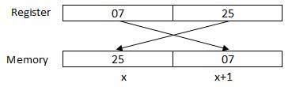

# Main Resources
https://www.tutorialspoint.com/assembly_programming/index.htm

## Supplemental Resources
foo

# Introduction
https://www.tutorialspoint.com/assembly_programming/assembly_introduction.htm

## Addressing Data in Memory
The process through which the processor controls the execution of instructions is referred as the fetch-decode-execute cycle or the execution cycle. It consists of three continuous steps −

- Fetching the instruction from memory
- Decoding or identifying the instruction
- Executing the instruction

The processor may access one or more bytes of memory at a time. Let us consider a hexadecimal number 0725H. This number will require two bytes of memory. The high-order byte or most significant byte is 07 and the low-order byte is 25.

The processor stores data in reverse-byte sequence, i.e., a low-order byte is stored in a low memory address and a high-order byte in high memory address. So, if the processor brings the value 0725H from register to memory, it will transfer 25 first to the lower memory address and 07 to the next memory address.

  
x: memory address

When the processor gets the numeric data from memory to register, it again reverses the bytes. There are two kinds of memory addresses −

Absolute address - a direct reference of specific location.

Segment address (or offset) - starting address of a memory segment with the offset value.

# Basic Syntax
An assembly program can be divided into three sections −

- The data section,
- The bss section, and
- The text section.

## The data Section
The data section is used for declaring initialized data or constants. This data does not change at runtime. You can declare various constant values, file names, or buffer size, etc., in this section.

The syntax for declaring data section is −
```
section.data
```

## The bss Section
The bss section is used for declaring variables. The syntax for declaring bss section is −
```
section.bss
```

## The text section
The text section is used for keeping the actual code. This section must begin with the declaration global _start, which tells the kernel where the program execution begins.

The syntax for declaring text section is −
```
section.text
global _start
_start:
```

## Comments
Assembly language comment begins with a semicolon (;). It may contain any printable character including blank. It can appear on a line by itself, like −
```
; This program displays a message on screen
```
or, on the same line along with an instruction, like −
```
add eax, ebx     ; adds ebx to eax
```

## Assembly Language Statements
Assembly language programs consist of three types of statements −

- Executable instructions or instructions,
- Assembler directives or pseudo-ops, and
- Macros.
The executable instructions or simply instructions tell the processor what to do. Each instruction consists of an operation code (opcode). Each executable instruction generates one machine language instruction.

The assembler directives or pseudo-ops tell the assembler about the various aspects of the assembly process. These are non-executable and do not generate machine language instructions.

Macros are basically a text substitution mechanism.

## Syntax of Assembly Language Statements
Assembly language statements are entered one statement per line. Each statement follows the following format −
```
[label] mnemonic [operands] [;comment]
```
The fields in the square brackets are optional. A basic instruction has two parts, the first one is the name of the instruction (or the mnemonic), which is to be executed, and the second are the operands or the parameters of the command.

Following are some examples of typical assembly language statements −
```
INC COUNT ; Increment the memory variable COUNT

MOV TOTAL, 48 ; Transfer the value 48 in the
; memory variable TOTAL

ADD AH, BH ; Add the content of the
; BH register into the AH register

AND MASK1, 128 ; Perform AND operation on the
; variable MASK1 and 128

ADD MARKS, 10 ; Add 10 to the variable MARKS
MOV AL, 10 ; Transfer the value 10 to the AL register
```
Compiling and Linking an Assembly Program in NASM
Make sure you have set the path of nasm and ld binaries in your PATH environment variable. Now, take the following steps for compiling and linking the above program −

Type the above code using a text editor and save it as hello.asm.

Make sure that you are in the same directory as where you saved hello.asm.

To assemble the program, type nasm -f elf hello.asm

If there is any error, you will be prompted about that at this stage. Otherwise, an object file of your program named hello.o will be created.

To link the object file and create an executable file named hello, type ld -m elf_i386 -s -o hello hello.o

Execute the program by typing ./hello

If you have done everything correctly, it will display 'Hello, world!' on the screen.

# Memory Segments
We have already discussed the three sections of an assembly program. These sections represent various memory segments as well.

Interestingly, if you replace the section keyword with segment, you will get the same result. Try the following code −
```
segment .text           ;code segment
    global _start       ;must be declared for linker

_start:                 ;tell linker entry point
    mov edx,len         ;message length
    mov ecx,msg         ;message to write
    mov ebx,1           ;file descriptor (stdout)
    mov eax,4           ;syscall number (sys_write)
    int 0x80            ;call kernel

    mov eax,1           ;syscall number (sys_exit)
    int 0x80            ;call kernel

sgement .data           ;data segment
msg db 'Hello, world!',0xa      ;our dear string
len equ $ - msg         ;length of our dear string
```


#

#

#