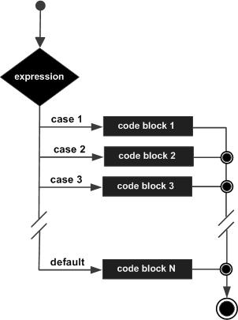
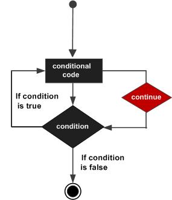

# Main Resources
https://www.tutorialspoint.com/cprogramming/c_header_files.htm  

## Supplemental Resources
https://courses.cs.washington.edu/courses/cse351/17wi/lectures/CSE351-L02-memory-I_17wi.pdf
https://www.youtube.com/watch?v=-uleG_Vecishttps://www.youtube.com/watch?v=-uleG_Vecis

# Integer Types
```
Type           Storage size                         Value range  
char             1 byte                               -128 to 127 or 0 to 255  
unsigned char    1 byte                               0 to 255  
signed char      1 byte                               -128 to 127  
int              2 or 4 bytes                         -32,768 to 32,767 or -2,147,483,648 to 2,147,483,647  
unsigned int     2 or 4 bytes                         0 to 65,535 or 0 to 4,294,967,295  
short            2 bytes                              -32,768 to 32,767  
unsigned short   2 bytes                              0 to 65,535  
long             8 bytes or (4bytes for 32 bit OS)    -9223372036854775808 to 9223372036854775807  
unsigned long    8 bytes                              0 to 18446744073709551615
```

## Exact size on a platform
```c
#include <stdio.h>
#include <stdlib.h>
#include <limits.h>
#include <float.h>

int main(int argc, char** argv) {

    printf("CHAR_BIT    :   %d\n", CHAR_BIT);
    printf("CHAR_MAX    :   %d\n", CHAR_MAX);
    printf("CHAR_MIN    :   %d\n", CHAR_MIN);
    printf("INT_MAX     :   %d\n", INT_MAX);
    printf("INT_MIN     :   %d\n", INT_MIN);
    printf("LONG_MAX    :   %ld\n", (long) LONG_MAX);
    printf("LONG_MIN    :   %ld\n", (long) LONG_MIN);
    printf("SCHAR_MAX   :   %d\n", SCHAR_MAX);
    printf("SCHAR_MIN   :   %d\n", SCHAR_MIN);
    printf("SHRT_MAX    :   %d\n", SHRT_MAX);
    printf("SHRT_MIN    :   %d\n", SHRT_MIN);
    printf("UCHAR_MAX   :   %d\n", UCHAR_MAX);
    printf("UINT_MAX    :   %u\n", (unsigned int) UINT_MAX);
    printf("ULONG_MAX   :   %lu\n", (unsigned long) ULONG_MAX);
    printf("USHRT_MAX   :   %d\n", (unsigned short) USHRT_MAX);

    return 0;
}
```

# Floating Types
Type	        Storage size	Value range	            Precision
float	        4 byte	        1.2E-38 to 3.4E+38	    6 decimal places
double	        8 byte	        2.3E-308 to 1.7E+308	15 decimal places
long double	    10 byte	        3.4E-4932 to 1.1E+4932	19 decimal places

## Exact size on a platform
```c
#include <stdio.h>
#include <stdlib.h>
#include <limits.h>
#include <float.h>

int main(int argc, char** argv) {

    printf("Storage size for float : %d \n", sizeof(float));
    printf("FLT_MAX     :   %g\n", (float) FLT_MAX);
    printf("FLT_MIN     :   %g\n", (float) FLT_MIN);
    printf("-FLT_MAX    :   %g\n", (float) -FLT_MAX);
    printf("-FLT_MIN    :   %g\n", (float) -FLT_MIN);
    printf("DBL_MAX     :   %g\n", (double) DBL_MAX);
    printf("DBL_MIN     :   %g\n", (double) DBL_MIN);
    printf("-DBL_MAX     :  %g\n", (double) -DBL_MAX);
    printf("Precision value: %d\n", FLT_DIG );

    return 0;
}
```

# Constants
Using #define preprocessor:
#define <identifier> <value>
#define LENGTH 10

Using const keyword:
const int <identifier> <value>
const int LENGTH 10

**Note that it is a good programming practice to define constants in CAPITALS.**

# Storage Classes
A storage class defines the scope (visibility) and life-time of variables and/or functions within a C program. They preced the type that they modify. We have four different storage clases in a C program.
    - auto
    - register
    - static
    - extern

## auto
Default storage class for all local variables. 'auto' can only be used within functions, i.e., local variables.
```c
{
    int mount;
    auto int month;
}
```

## register
The register storage class is used to define local vars that should be stored in a reg instead of RAM. This means that the variable has a maximum size equal to the reg size (usually one word) and can't have the unary '&' operator applied to it (as it does not have a mem location).
```c
{
    register int miles;
}
```

## static
The static storage class instructs the compiler to keep a local var in existence during the life-time of the program instead of creating and destroying it each time it comes into and goes out of scope. Therefore, making local vars static allows them to maintain their values between func calls.

The static modifier may also be applied to global vars. When this is done, it causes that var's scope to be restricted to the file in which it is declared.

In C programming, when static is used on a global var, it causes only one copy of that member to be shared by all the objects of its class.

## extern
The extern storage class is used to give a ref of a global var that is visible to ALL the program files. When you use 'extern', the var cannot be initialized however, it points the var name at a storage location that has been previously defined.

When you have multiple files and you define a global var or func, which will also be used in other files, then extern will be used in another file to provide the reference of defined var or func.  
**Just for understanding, extern is used to declare a global var or func in another file.**  
The extern modifier is most commonly used when there are two or more files sharing the same global vars or funcs as explained below.


**First File: main.c**
```c
#include <stdio.h>
 
int count ;
extern void write_extern();
 
main() {
   count = 5;
   write_extern();
}
```
**Second File: support.c**
```c
#include <stdio.h>
 
extern int count;
 
void write_extern(void) {
   printf("count is %d\n", count);
}
```

# Operators
An operator is a symbol that tells the compiler to perform specific mathematical or logical functions. C language is rich in built-in operators and provides the following types of operators:
- Arithmetic
- Relational
- Logical
- Bitwise
- Assignment
- Misc

## Arithmetic
The following table shows all the arithmetic operators supported by the C language. Assume variable A holds 10 and variable B holds 20 then −
```
Operator	Description	                                                    Example
+	        Adds two operands.	                                            A + B = 30
−	        Subtracts second operand from the first.	                    A − B = -10
*	        Multiplies both operands.	                                    A * B = 200
/	        Divides numerator by de-numerator.	                            B / A = 2
%	        Modulus Operator and remainder of after an integer division.	B % A = 0
++	        Increment operator increases the integer value by one.	        A++ = 11
--	        Decrement operator decreases the integer value by one.	        A-- = 9
```

## Relational
The following table shows all the relational operators supported by C. Assume variable A holds 10 and variable B holds 20 then −
```
Operator	Description	                                                                                                                            Example
==	        Checks if the values of two operands are equal or not. If yes, then the condition becomes true.	                                        (A == B) is not true.
!=	        Checks if the values of two operands are equal or not. If the values are not equal, then the condition becomes true.	                (A != B) is true.
>	        Checks if the value of left operand is greater than the value of right operand. If yes, then the condition becomes true.	            (A > B) is not true.
<	        Checks if the value of left operand is less than the value of right operand. If yes, then the condition becomes true.	                (A < B) is true.
>=	        Checks if the value of left operand is greater than or equal to the value of right operand. If yes, then the condition becomes true.	(A >= B) is not true.
<=	        Checks if the value of left operand is less than or equal to the value of right operand. If yes, then the condition becomes true.	    (A <= B) is true.
```

## Logical
Following table shows all the logical operators supported by C language. Assume variable A holds 1 and variable B holds 0, then −
```
Operator	Description	                                                                                            Example
&&	        Called Logical AND operator. If both the operands are non-zero, then the condition becomes true.	    (A && B) is false.
||	        Called Logical OR Operator. If any of the two operands is non-zero, then the condition becomes true.	(A || B) is true.
!	        Called Logical NOT Operator. It is used to reverse the logical state of its operand.	                !(A && B) is true.
```

## Bitwise
Bitwise operator works on bits and perform bit-by-bit operation. The truth tables for &, |, and ^ is as follows −
```
p	    q	    p & q	p | q	p ^ q
0	    0	      0	      0	      0
0	    1	      0	      1	      1
1	    1	      1	      1	      0
1	    0	      0	      1	      1
```
Assume A = 60 and B = 13 in binary format, they will be as follows −
```
A = 0011 1100
B = 0000 1101
-----------------
A&B = 0000 1100
A|B = 0011 1101
A^B = 0011 0001
~A = 1100 0011
```
The following table lists the bitwise operators supported by C. Assume variable 'A' holds 60 and variable 'B' holds 13, then −
```
                                                                                                                                                        A = 0011 1100
                                                                                                                                                        B = 0000 1101

Operator	Description	                                                                                                                Example
&	        Binary AND Operator copies a bit to the result if it exists in both operands.	                                            (A & B) = 12, i.e., 0000 1100
|	        Binary OR Operator copies a bit if it exists in either operand.	                                                            (A | B) = 61, i.e., 0011 1101
^	        Binary XOR Operator copies the bit if it is set in one operand but not both.	                                            (A ^ B) = 49, i.e., 0011 0001
~	        Binary One's Complement Operator is unary and has the effect of 'flipping' bits.	                                        (~A ) = ~(60) i.e,. -011 1101
<<	        Binary Left Shift Operator. The left operands value is moved left by the number of bits specified by the right operand.	    A << 2 = 240  i.e., 1111 0000
>>	        Binary Right Shift Operator. The left operands value is moved right by the number of bits specified by the right operand.	A >> 2 = 15   i.e., 0000 1111
```

## Assignment
The following table lists the assignment operators supported by the C language −
```
Operator	Description	                                                                                                                        Example
=	        Simple assignment operator. Assigns values from right side operands to left side operand	                                        C = A + B will assign the value of A + B to C
+=	        Add AND assignment operator. It adds the right operand to the left operand and assign the result to the left operand.	            C += A is equivalent to C = C + A
-=	        Subtract AND assignment operator. It subtracts the right operand from the left operand and assigns the result to the left operand.	C -= A is equivalent to C = C - A
*=	        Multiply AND assignment operator. It multiplies the right operand with the left operand and assigns the result to the left operand.	C *= A is equivalent to C = C * A
/=	        Divide AND assignment operator. It divides the left operand with the right operand and assigns the result to the left operand.	    C /= A is equivalent to C = C / A
%=	        Modulus AND assignment operator. It takes modulus using two operands and assigns the result to the left operand.	                C %= A is equivalent to C = C % A
<<=	        Left shift AND assignment operator.	                                                                                                C <<= 2 is same as C = C << 2
>>=	        Right shift AND assignment operator.	                                                                                            C >>= 2 is same as C = C >> 2
&=	        Bitwise AND assignment operator.	                                                                                                C &= 2 is same as C = C & 2
^=	        Bitwise exclusive OR and assignment operator.	                                                                                    C ^= 2 is same as C = C ^ 2
|=	        Bitwise inclusive OR and assignment operator.	                                                                                    C |= 2 is same as C = C | 2
```

## Misc Operators ↦ sizeof & ternary
Besides the operators discussed above, there are a few other important operators including sizeof and ? : supported by the C Language.
```
Operator	Description	                            Example
sizeof()	Returns the size of a variable.	        sizeof(a), where a is integer, will return 4.
&	        Returns the address of a variable.	    &a; returns the actual address of the variable.
*	        Pointer to a variable.	                *a;
? :	        Conditional Expression.	                If Condition is true ? then value X : otherwise value Y
```

## Operators Precedence in C
Operator precedence determines the grouping of terms in an expression and decides how an expression is evaluated. Certain operators have higher precedence than others; for example, the multiplication operator has a higher precedence than the addition operator.

For example, x = 7 + 3 * 2; here, x is assigned 13, not 20 because operator * has a higher precedence than +, so it first gets multiplied with 3*2 and then adds into 7.

Here, operators with the highest precedence appear at the top of the table, those with the lowest appear at the bottom. Within an expression, higher precedence operators will be evaluated first.

```
Category	        Operator    	                        Associativity
Postfix	            () [] -> . ++ - -	                    Left to right
Unary	            + - ! ~ ++ - - (type)* & sizeof	        Right to left
Multiplicative	    * / %	                                Left to right
Additive	        + -	                                    Left to right
Shift	            << >>	                                Left to right
Relational	        < <= > >=	                            Left to right
Equality	        == !=	                                Left to right
Bitwise AND	        &	                                    Left to right
Bitwise XOR	        ^	                                    Left to right
Bitwise OR	        |	                                    Left to right
Logical AND	        &&	                                    Left to right
Logical OR	        ||	                                    Left to right
Conditional	        ?:	                                    Right to left
Assignment	        = += -= *= /= %=>>= <<= &= ^= |=	    Right to left
Comma	            ,	                                    Left to right
```

# Decision Making


C programming language provides the following types of decision making statements.
```
Sr.No.	        Statement & Description  
1	            if statement  
                An if statement consists of a boolean expression followed by one or more statements.

2	            if...else statement  
                An if statement can be followed by an optional else statement, which executes when the Boolean expression is false.

3	            nested if statements  
                You can use one if or else if statement inside another if or else if statement(s).

4	            switch statement  
                A switch statement allows a variable to be tested for equality against a list of values.

5	            nested switch statements  
                You can use one switch statement inside another switch statement(s).
```


## Switch Statement
A switch statement allows a variable to be tested for equality against a list of values. Each value is called a case, and the variable being switched on is checked for each switch case.

The syntax for a switch statement in C programming language is as follows −
```c
switch(expression) {

   case constant-expression  :
      statement(s);
      break; /* optional */
	
   case constant-expression  :
      statement(s);
      break; /* optional */
  
   /* you can have any number of case statements */
   default : /* Optional */
   statement(s);
}
```
The following rules apply to a switch statement −

The expression used in a switch statement must have an integral or enumerated type, or be of a class type in which the class has a single conversion function to an integral or enumerated type.

You can have any number of case statements within a switch. Each case is followed by the value to be compared to and a colon.

The constant-expression for a case must be the same data type as the variable in the switch, and it must be a constant or a literal.

When the variable being switched on is equal to a case, the statements following that case will execute until a break statement is reached.

When a break statement is reached, the switch terminates, and the flow of control jumps to the next line following the switch statement.

Not every case needs to contain a break. If no break appears, the flow of control will fall through to subsequent cases until a break is reached.

A switch statement can have an optional default case, which must appear at the end of the switch. The default case can be used for performing a task when none of the cases is true. No break is needed in the default case.

### Flow Diagram  


## The ? : Operator
We have covered conditional operator ? : in the previous chapter which can be used to replace if...else statements. It has the following general form −  

Exp1 ? Exp2 : Exp3;  
Where Exp1, Exp2, and Exp3 are expressions. Notice the use and placement of the colon.  

The value of a ? expression is determined like this −  

Exp1 is evaluated. If it is true, then Exp2 is evaluated and becomes the value of the entire ? expression.  

If Exp1 is false, then Exp3 is evaluated and its value becomes the value of the expression.  

# Loops
C programming language provides the following types of loops to handle looping requirements.
```
Sr.No.	        Loop Type & Description
1	            while loop
                Repeats a statement or group of statements while a given condition is true. It tests the condition before executing the loop body.

2	            for loop
                Executes a sequence of statements multiple times and abbreviates the code that manages the loop variable.

3	            do...while loop
                It is more like a while statement, except that it tests the condition at the end of the loop body.

4	            nested loops
                You can use one or more loops inside any other while, for, or do..while loop.
```
## While Loop
A while loop in C programming repeatedly executes a target statement as long as a given condition is true.

The syntax of a while loop in C programming language is −
```c
while(condition) {
statement(s);
}
```
Here, statement(s) may be a single statement or a block of statements. The condition may be any expression, and true is any nonzero value. The loop iterates while the condition is true.

When the condition becomes false, the program control passes to the line immediately following the loop.

### Flow Diagram


## For Loop
A for loop is a repetition control structure that allows you to efficiently write a loop that needs to execute a specific number of times.

The syntax of a for loop in C programming language is −
```c
for ( init; condition; increment ) {
statement(s);
}
```
Here is the flow of control in a 'for' loop −

The init step is executed first, and only once. This step allows you to declare and initialize any loop control variables. You are not required to put a statement here, as long as a semicolon appears.

Next, the condition is evaluated. If it is true, the body of the loop is executed. If it is false, the body of the loop does not execute and the flow of control jumps to the next statement just after the 'for' loop.

After the body of the 'for' loop executes, the flow of control jumps back up to the increment statement. This statement allows you to update any loop control variables. This statement can be left blank, as long as a semicolon appears after the condition.

The condition is now evaluated again. If it is true, the loop executes and the process repeats itself (body of loop, then increment step, and then again condition). After the condition becomes false, the 'for' loop terminates.

### Flow Diagram


## Do...while Loop
Unlike for and while loops, which test the loop condition at the top of the loop, the do...while loop in C programming checks its condition at the bottom of the loop.

A do...while loop is similar to a while loop, except the fact that it is guaranteed to execute at least one time.

The syntax of a do...while loop in C programming language is −
```c
do {
statement(s);
} while( condition );
Notice that the conditional expression appears at the end of the loop, so the statement(s) in the loop executes once before the condition is tested.
```
If the condition is true, the flow of control jumps back up to do, and the statement(s) in the loop executes again. This process repeats until the given condition becomes false.

### Flow Diagram


## Nested Loops
C programming allows to use one loop inside another loop. The following section shows a few examples to illustrate the concept.

The syntax for a nested for loop statement in C is as follows −
```c
for ( init; condition; increment ) {

for ( init; condition; increment ) {
statement(s);
}
statement(s);
}
```
The syntax for a nested while loop statement in C programming language is as follows −
```c
while(condition) {

while(condition) {
statement(s);
}
statement(s);
}
```
The syntax for a nested do...while loop statement in C programming language is as follows −
```c
do {
statement(s);

do {
statement(s);
}while( condition );

}while( condition );
```
A final note on loop nesting is that you can put any type of loop inside any other type of loop. For example, a 'for' loop can be inside a 'while' loop or vice versa.

## Break Statements
The break statement in C programming has the following two usages −

When a break statement is encountered inside a loop, the loop is immediately terminated and the program control resumes at the next statement following the loop.

It can be used to terminate a case in the switch statement (covered in the next chapter).

If you are using nested loops, the break statement will stop the execution of the innermost loop and start executing the next line of code after the block.

The syntax for a break; statement in C is as follows −
```c
break;
```
### Flow Diagram


## Continue Statements
The continue statement in C programming works somewhat like the break statement. Instead of forcing termination, it forces the next iteration of the loop to take place, skipping any code in between.

For the for loop, continue statement causes the conditional test and increment portions of the loop to execute. For the while and do...while loops, continue statement causes the program control to pass to the conditional tests.

The syntax for a continue statement in C is as follows −
```c
continue;
```
### Flow Diagram


## Goto Statements
A goto statement in C programming provides an unconditional jump from the 'goto' to a labeled statement in the same function.

NOTE − Use of goto statement is highly discouraged in any programming language because it makes difficult to trace the control flow of a program, making the program hard to understand and hard to modify. Any program that uses a goto can be rewritten to avoid them.

The syntax for a goto statement in C is as follows −
```c
goto label;
..
.
label: statement;
```
Here label can be any plain text except C keyword and it can be set anywhere in the C program above or below to goto statement.

### Flow Diagram


# The Infinite Loop
A loop becomes an infinite loop if a condition never becomes false. The for loop is traditionally used for this purpose. Since none of the three expressions that form the 'for' loop are required, you can make an endless loop by leaving the conditional expression empty.
```c
#include <stdio.h>
 
int main () {

   for( ; ; ) {
      printf("This loop will run forever.\n");
   }

   return 0;
}
```
When the conditional expression is absent, it is assumed to be true. You may have an initialization and increment expression, but C programmers more commonly use the for(;;) construct to signify an infinite loop.

NOTE − You can terminate an infinite loop by pressing Ctrl + C keys.

# Functions
A function is a group of statements that together perform a task. Every C program has at least one function, which is main(), and all the most trivial programs can define additional functions.

You can divide up your code into separate functions. How you divide up your code among different functions is up to you, but logically the division is such that each function performs a specific task.

A function declaration tells the compiler about a function's name, return type, and parameters. A function definition provides the actual body of the function.

The C standard library provides numerous built-in functions that your program can call. For example, strcat() to concatenate two strings, memcpy() to copy one memory location to another location, and many more functions.

A function can also be referred as a method or a sub-routine or a procedure, etc.

## Defining a Function
The general form of a function definition in C programming language is as follows −
```c
return_type function_name( parameter list ) {
   body of the function
}
```
A function definition in C programming consists of a function header and a function body. Here are all the parts of a function −

Return Type − A function may return a value. The return_type is the data type of the value the function returns. Some functions perform the desired operations without returning a value. In this case, the return_type is the keyword void.

Function Name − This is the actual name of the function. The function name and the parameter list together constitute the function signature.

Parameters − A parameter is like a placeholder. When a function is invoked, you pass a value to the parameter. This value is referred to as actual parameter or argument. The parameter list refers to the type, order, and number of the parameters of a function. Parameters are optional; that is, a function may contain no parameters.

Function Body − The function body contains a collection of statements that define what the function does.

### Example
Given below is the source code for a function called max(). This function takes two parameters num1 and num2 and returns the maximum value between the two −
```c
/* function returning the max between two numbers */
int max(int num1, int num2) {

   /* local variable declaration */
   int result;
 
   if (num1 > num2)
      result = num1;
   else
      result = num2;
 
   return result; 
}
```

### Function Declarations
A function declaration tells the compiler about a function name and how to call the function. The actual body of the function can be defined separately.

A function declaration has the following parts −

return_type function_name( parameter list );
For the above defined function max(), the function declaration is as follows −

int max(int num1, int num2);
Parameter names are not important in function declaration only their type is required, so the following is also a valid declaration −

int max(int, int);
Function declaration is required when you define a function in one source file and you call that function in another file. In such case, you should declare the function at the top of the file calling the function.

### Calling a Function

While creating a C function, you give a definition of what the function has to do. To use a function, you will have to call that function to perform the defined task.

When a program calls a function, the program control is transferred to the called function. A called function performs a defined task and when its return statement is executed or when its function-ending closing brace is reached, it returns the program control back to the main program.

To call a function, you simply need to pass the required parameters along with the function name, and if the function returns a value, then you can store the returned value. For example −
```c
#include <stdio.h>
 
/* function declaration */
int max(int num1, int num2);
 
int main () {

   /* local variable definition */
   int a = 100;
   int b = 200;
   int ret;
 
   /* calling a function to get max value */
   ret = max(a, b);
 
   printf( "Max value is : %d\n", ret );
 
   return 0;
}
 
/* function returning the max between two numbers */
int max(int num1, int num2) {

   /* local variable declaration */
   int result;
 
   if (num1 > num2)
      result = num1;
   else
      result = num2;
 
   return result; 
```

### Function Arguments
If a function is to use arguments, it must declare variables that accept the values of the arguments. These variables are called the formal parameters of the function.

Formal parameters behave like other local variables inside the function and are created upon entry into the function and destroyed upon exit.

While calling a function, there are two ways in which arguments can be passed to a function −
```
Sr.No.	Call Type & Description
1	    Call by value
        This method copies the actual value of an argument into the formal parameter of the function. In this case, changes made to the parameter inside the function have no effect on the argument.

2	    Call by reference
        This method copies the address of an argument into the formal parameter. Inside the function, the address is used to access the actual argument used in the call. This means that changes made to the parameter affect the argument.
```
By default, C uses call by value to pass arguments. In general, it means the code within a function cannot alter the arguments used to call the function.

## Call by Value
The call by value method of passing arguments to a function copies the actual value of an argument into the formal parameter of the function. In this case, changes made to the parameter inside the function have no effect on the argument.

By default, C programming uses call by value to pass arguments. In general, it means the code within a function cannot alter the arguments used to call the function. Consider the function swap() definition as follows.

```c
/* function definition to swap the values */
void swap(int x, int y) {

   int temp;

   temp = x; /* save the value of x */
   x = y;    /* put y into x */
   y = temp; /* put temp into y */
  
   return;
}
```
Now, let us call the function swap() by passing actual values as in the following example −

```c
#include <stdio.h>
 
/* function declaration */
void swap(int x, int y);
 
int main () {

   /* local variable definition */
   int a = 100;
   int b = 200;
 
   printf("Before swap, value of a : %d\n", a );
   printf("Before swap, value of b : %d\n", b );
 
   /* calling a function to swap the values */
   swap(a, b);
 
   printf("After swap, value of a : %d\n", a );
   printf("After swap, value of b : %d\n", b );
 
   return 0;
}
void swap(int x, int y) {

   int temp;

   temp = x; /* save the value of x */
   x = y;    /* put y into x */
   y = temp; /* put temp into y */
  
   return;
}
```
Let us put the above code in a single C file, compile and execute it, it will produce the following result −
```
Before swap, value of a : 100
Before swap, value of b : 200
After swap, value of a : 100
After swap, value of b : 200
```
It shows that there are no changes in the values, though they had been changed inside the function.

## Call by Reference
The call by reference method of passing arguments to a function copies the address of an argument into the formal parameter. Inside the function, the address is used to access the actual argument used in the call. It means the changes made to the parameter affect the passed argument.

To pass a value by reference, argument pointers are passed to the functions just like any other value. So accordingly you need to declare the function parameters as pointer types as in the following function swap(), which exchanges the values of the two integer variables pointed to, by their arguments.
```c
/* function definition to swap the values */
void swap(int *x, int *y) {

int temp;
temp = *x; /* save the value at address x */
*x = *y; /* put y into x */
*y = temp; /* put temp into y */

return;
}
```
Let us now call the function swap() by passing values by reference as in the following example −

```c
#include <stdio.h>

int main () {

   /* local variable definition */
   int a = 100;
   int b = 200;
 
   printf("Before swap, value of a : %d\n", a );
   printf("Before swap, value of b : %d\n", b );
 
   /* calling a function to swap the values */
   swap(&a, &b);
 
   printf("After swap, value of a : %d\n", a );
   printf("After swap, value of b : %d\n", b );
 
   return 0;
}
void swap(int *x, int *y) {

   int temp;

   temp = *x; /* save the value of x */
   *x = *y;    /* put y into x */
   *y = temp; /* put temp into y */
  
   return;
}
```
Let us put the above code in a single C file, compile and execute it, to produce the following result −
```
Before swap, value of a : 100
Before swap, value of b : 200
After swap, value of a : 200
After swap, value of b : 100
```
It shows that the change has reflected outside the function as well, unlike call by value where the changes do not reflect outside the function.

# Scope Rules
A scope in any programming is a region of the program where a defined variable can have its existence and beyond that variable it cannot be accessed. There are three places where variables can be declared in C programming language −

Inside a function or a block which is called local variables.

Outside of all functions which is called global variables.

In the definition of function parameters which are called formal parameters.

Let us understand what are local and global variables, and formal parameters.

## Local Variables
Variables that are declared inside a function or block are called local variables. They can be used only by statements that are inside that function or block of code. Local variables are not known to functions outside their own. The following example shows how local variables are used. Here all the variables a, b, and c are local to main() function.
```c
#include <stdio.h>
 
int main () {

  /* local variable declaration */
  int a, b;
  int c;
 
  /* actual initialization */
  a = 10;
  b = 20;
  c = a + b;
 
  printf ("value of a = %d, b = %d and c = %d\n", a, b, c);
 
  return 0;
}
```

## Global Variables
Global variables are defined outside a function, usually on top of the program. Global variables hold their values throughout the lifetime of your program and they can be accessed inside any of the functions defined for the program.

A global variable can be accessed by any function. That is, a global variable is available for use throughout your entire program after its declaration. The following program show how global variables are used in a program.
```c
#include <stdio.h>
 
/* global variable declaration */
int g;
 
int main () {

  /* local variable declaration */
  int a, b;
 
  /* actual initialization */
  a = 10;
  b = 20;
  g = a + b;
 
  printf ("value of a = %d, b = %d and g = %d\n", a, b, g);
 
  return 0;
}
```
A program can have same name for local and global variables but the value of local variable inside a function will take preference. Here is an example −

```c
#include <stdio.h>
 
/* global variable declaration */
int g = 20;
 
int main () {

  /* local variable declaration */
  int g = 10;
 
  printf ("value of g = %d\n",  g);
 
  return 0;
}
```
When the above code is compiled and executed, it produces the following result −
```
value of g = 10
```

## Formal Parameters
Formal parameters, are treated as local variables with-in a function and they take precedence over global variables. Following is an example −

```c
#include <stdio.h>
 
/* global variable declaration */
int a = 20;
 
int main () {

  /* local variable definition in main function */
  int a = 10;
  int b = 20;
  int c = 0;

  printf ("value of a in main() = %d\n",  a);
  c = sum( a, b);
  printf ("value of c in main() = %d\n",  c);

  return 0;
}

/* function to add two integers */
int sum(int a, int b) {

   printf ("value of a in sum() = %d\n",  a);
   printf ("value of b in sum() = %d\n",  b);

   return a + b;
}
```
When the above code is compiled and executed, it produces the following result −
```
value of a in main() = 10
value of a in sum() = 10
value of b in sum() = 20
value of c in main() = 30
```

## Initializing Local and Global Variables
When a local variable is defined, it is not initialized by the system, you must initialize it yourself. Global variables are initialized automatically by the system when you define them as follows −
```
Data Type	    Initial Default Value
int	            0
char	            '\0'
float	            0
double	         0
pointer	         NULL
```
**It is a good programming practice to initialize variables properly, otherwise your program may produce unexpected results, because uninitialized variables will take some garbage value already available at their memory location.**

# Arrays
Arrays a kind of data structure that can store a fixed-size sequential collection of elements of the same type. An array is used to store a collection of data, but it is often more useful to think of an array as a collection of variables of the same type.

Instead of declaring individual variables, such as number0, number1, ..., and number99, you declare one array variable such as numbers and use numbers[0], numbers[1], and ..., numbers[99] to represent individual variables. A specific element in an array is accessed by an index.

All arrays consist of contiguous memory locations. The lowest address corresponds to the first element and the highest address to the last element.


## Declaring Arrays
To declare an array in C, a programmer specifies the type of the elements and the number of elements required by an array as follows −
```c
type arrayName [ arraySize ];
```
This is called a single-dimensional array. The arraySize must be an integer constant greater than zero and type can be any valid C data type. For example, to declare a 10-element array called balance of type double, use this statement −
```c
double balance[10];
```
Here *balance* is a variable array which is sufficient to hold up to 10 double numbers.

## Initializing Arrays

You can initialize an array in C either one by one or using a single statement as follows −
```c
double balance[5] = {1000.0, 2.0, 3.4, 7.0, 50.0};
```
The number of values between braces { } cannot be larger than the number of elements that we declare for the array between square brackets [ ].

If you omit the size of the array, an array just big enough to hold the initialization is created. Therefore, if you write −
```c
double balance[] = {1000.0, 2.0, 3.4, 7.0, 50.0};
```
You will create exactly the same array as you did in the previous example. Following is an example to assign a single element of the array −
```c
balance[4] = 50.0;
```
The above statement assigns the 5th element in the array with a value of 50.0. All arrays have 0 as the index of their first element which is also called the base index and the last index of an array will be total size of the array minus 1. Shown below is the pictorial representation of the array we discussed above −


## Accessing Array Elements
Accessing Array Elements

An element is accessed by indexing the array name. This is done by placing the index of the element within square brackets after the name of the array. For example −
```c
double salary = balance[9];
```
The above statement will take the 10th element from the array and assign the value to salary variable. The following example Shows how to use all the three above mentioned concepts viz. declaration, assignment, and accessing arrays −
```c
#include <stdio.h>
 
int main () {

   int n[ 10 ]; /* n is an array of 10 integers */
   int i,j;
 
   /* initialize elements of array n to 0 */         
   for ( i = 0; i < 10; i++ ) {
      n[ i ] = i + 100; /* set element at location i to i + 100 */
   }
   
   /* output each array element's value */
   for (j = 0; j < 10; j++ ) {
      printf("Element[%d] = %d\n", j, n[j] );
   }
 
   return 0;
}
```
When the above code is compiled and executed, it produces the following result −
```
Element[0] = 100
Element[1] = 101
Element[2] = 102
Element[3] = 103
Element[4] = 104
Element[5] = 105
Element[6] = 106
Element[7] = 107
Element[8] = 108
Element[9] = 109
```

# Arrays in Detail

Arrays are important to C and should need a lot more attention. The following important concepts related to array should be clear to a C programmer −

## Multi-dimensional Arrays in C
C programming language allows multidimensional arrays. Here is the general form of a multidimensional array declaration −
```c
type name[size1][size2]...[sizeN];
```
For example, the following declaration creates a three dimensional integer array −
```c
int threedim[5][10][4];
```

### Two-dimensional Arrays

The simplest form of multidimensional array is the two-dimensional array. A two-dimensional array is, in essence, a list of one-dimensional arrays. To declare a two-dimensional integer array of size [x][y], you would write something as follows −
```c
type arrayName [ x ][ y ];
```
Where **type** can be any valid C data type and **arrayName** will be a valid C identifier. A two-dimensional array can be considered as a table which will have x number of rows and y number of columns. A two-dimensional array **a**, which contains three rows and four columns can be shown as follows −


Thus, every element in the array a is identified by an element name of the form a[ i ][ j ], where 'a' is the name of the array, and 'i' and 'j' are the subscripts that uniquely identify each element in 'a'.

### Initializing Two-Dimensional Arrays
Multidimensional arrays may be initialized by specifying bracketed values for each row. Following is an array with 3 rows and each row has 4 columns.
```c
int a[3][4] = {  
   {0, 1, 2, 3} ,   /*  initializers for row indexed by 0 */
   {4, 5, 6, 7} ,   /*  initializers for row indexed by 1 */
   {8, 9, 10, 11}   /*  initializers for row indexed by 2 */
};
```
The nested braces, which indicate the intended row, are optional. The following initialization is equivalent to the previous example −
```c
int a[3][4] = {0,1,2,3,4,5,6,7,8,9,10,11};
```

### Accessing Two-Dimensional Array Elements
An element in a two-dimensional array is accessed by using the subscripts, i.e., row index and column index of the array. For example −
```c
int val = a[2][3];
```
The above statement will take the 4th element from the 3rd row of the array. You can verify it in the above figure. Let us check the following program where we have used a nested loop to handle a two-dimensional array −

```c
#include <stdio.h>
 
int main () {

   /* an array with 5 rows and 2 columns*/
   int a[5][2] = { {0,0}, {1,2}, {2,4}, {3,6},{4,8}};
   int i, j;
 
   /* output each array element's value */
   for ( i = 0; i < 5; i++ ) {

      for ( j = 0; j < 2; j++ ) {
         printf("a[%d][%d] = %d\n", i,j, a[i][j] );
      }
   }
   
   return 0;
}
```
When the above code is compiled and executed, it produces the following result −
```c
a[0][0]: 0
a[0][1]: 0
a[1][0]: 1
a[1][1]: 2
a[2][0]: 2
a[2][1]: 4
a[3][0]: 3
a[3][1]: 6
a[4][0]: 4
a[4][1]: 8
```
As explained above, you can have arrays with any number of dimensions, although it is likely that most of the arrays you create will be of one or two dimensions.

### Passing Arrays as Function Arguments in C
If you want to pass a single-dimension array as an argument in a function, you would have to declare a formal parameter in one of following three ways and all three declaration methods produce similar results because each tells the compiler that an integer pointer is going to be received. Similarly, you can pass multi-dimensional arrays as formal parameters.
Way-1

Formal parameters as a pointer −
```c
void myFunction(int *param) {
   .
   .
   .
}
```
Way-2

Formal parameters as a sized array −
```c
void myFunction(int param[10]) {
   .
   .
   .
}
```
Way-3

Formal parameters as an unsized array −
```c
void myFunction(int param[]) {
   .
   .
   .
}
```
Example

Now, consider the following function, which takes an array as an argument along with another argument and based on the passed arguments, it returns the average of the numbers passed through the array as follows −
```c
double getAverage(int arr[], int size) {

   int i;
   double avg;
   double sum = 0;

   for (i = 0; i < size; ++i) {
      sum += arr[i];
   }

   avg = sum / size;

   return avg;
}
```
Now, let us call the above function as follows −
```c
#include <stdio.h>
 
/* function declaration */
double getAverage(int arr[], int size);

int main () {

   /* an int array with 5 elements */
   int balance[5] = {1000, 2, 3, 17, 50};
   double avg;

   /* pass pointer to the array as an argument */
   avg = getAverage( balance, 5 ) ;
 
   /* output the returned value */
   printf( "Average value is: %f ", avg );
    
   return 0;
}
```
When the above code is compiled together and executed, it produces the following result −

Average value is: 214.400000

As you can see, the length of the array doesn't matter as far as the function is concerned because C performs no bounds checking for formal parameters.

### Return array from function in C
C programming does not allow to return an entire array as an argument to a function. However, you can return a pointer to an array by specifying the array's name without an index.

If you want to return a single-dimension array from a function, you would have to declare a function returning a pointer as in the following example −
```c
int * myFunction() {
   .
   .
   .
}
```
Second point to remember is that C does not advocate to return the address of a local variable to outside of the function, so you would have to define the local variable as static variable.

Now, consider the following function which will generate 10 random numbers and return them using an array and call this function as follows −
```c
#include <stdio.h>

/* function to generate and return random numbers */
int * getRandom( ) {

   static int  r[10];
   int i;

   /* set the seed */
   srand( (unsigned)time( NULL ) );
  
   for ( i = 0; i < 10; ++i) {
      r[i] = rand();
      printf( "r[%d] = %d\n", i, r[i]);
   }

   return r;
}

/* main function to call above defined function */
int main () {

   /* a pointer to an int */
   int *p;
   int i;

   p = getRandom();
	
   for ( i = 0; i < 10; i++ ) {
      printf( "*(p + %d) : %d\n", i, *(p + i));
   }

   return 0;
}
```
When the above code is compiled together and executed, it produces the following result −
```
r[0] = 313959809
r[1] = 1759055877
r[2] = 1113101911
r[3] = 2133832223
r[4] = 2073354073
r[5] = 167288147
r[6] = 1827471542
r[7] = 834791014
r[8] = 1901409888
r[9] = 1990469526
*(p + 0) : 313959809
*(p + 1) : 1759055877
*(p + 2) : 1113101911
*(p + 3) : 2133832223
*(p + 4) : 2073354073
*(p + 5) : 167288147
*(p + 6) : 1827471542
*(p + 7) : 834791014
*(p + 8) : 1901409888
*(p + 9) : 1990469526
```

## Pointer to an Array in C
It is most likely that you would not understand this section until you are through with the chapter 'Pointers'.

Assuming you have some understanding of pointers in C, let us start: An array name is a constant pointer to the first element of the array. Therefore, in the declaration −
```c
double balance[50];
```
balance is a pointer to &balance[0], which is the address of the first element of the array balance. Thus, the following program fragment assigns p as the address of the first element of balance −
```c
double *p;
double balance[10];

p = balance;
```
It is legal to use array names as constant pointers, and vice versa. Therefore, *(balance + 4) is a legitimate way of accessing the data at balance[4].

Once you store the address of the first element in 'p', you can access the array elements using *p, *(p+1), *(p+2) and so on. Given below is the example to show all the concepts discussed above −
```c
#include <stdio.h>

int main () {

   /* an array with 5 elements */
   double balance[5] = {1000.0, 2.0, 3.4, 17.0, 50.0};
   double *p;
   int i;

   p = balance;
 
   /* output each array element's value */
   printf( "Array values using pointer\n");
	
   for ( i = 0; i < 5; i++ ) {
      printf("*(p + %d) : %f\n",  i, *(p + i) );
   }

   printf( "Array values using balance as address\n");
	
   for ( i = 0; i < 5; i++ ) {
      printf("*(balance + %d) : %f\n",  i, *(balance + i) );
   }
 
   return 0;
}
```
When the above code is compiled and executed, it produces the following result −
```
Array values using pointer
*(p + 0) : 1000.000000
*(p + 1) : 2.000000
*(p + 2) : 3.400000
*(p + 3) : 17.000000
*(p + 4) : 50.000000
Array values using balance as address
*(balance + 0) : 1000.000000
*(balance + 1) : 2.000000
*(balance + 2) : 3.400000
*(balance + 3) : 17.000000
*(balance + 4) : 50.000000
```
In the above example, p is a pointer to double, which means it can store the address of a variable of double type. Once we have the address in p, *p will give us the value available at the address stored in p, as we have shown in the above example.

# Pointers
Pointers in C are easy and fun to learn. Some C programming tasks are performed more easily with pointers, and other tasks, such as dynamic memory allocation, cannot be performed without using pointers. So it becomes necessary to learn pointers to become a perfect C programmer. Let's start learning them in simple and easy steps.

As you know, every variable is a memory location and every memory location has its address defined which can be accessed using ampersand (&) operator, which denotes an address in memory. Consider the following example, which prints the address of the variables defined −
```c
#include <stdio.h>

int main () {

   int  var1;
   char var2[10];

   printf("Address of var1 variable: %x\n", &var1  );
   printf("Address of var2 variable: %x\n", &var2  );

   return 0;
}
```
When the above code is compiled and executed, it produces the following result −
```
Address of var1 variable: bff5a400
Address of var2 variable: bff5a3f6
```

## What are Pointers?

A pointer is a variable whose value is the address of another variable, i.e., direct address of the memory location. Like any variable or constant, you must declare a pointer before using it to store any variable address. The general form of a pointer variable declaration is −
```
type *var-name;
```
Here, type is the pointer's base type; it must be a valid C data type and var-name is the name of the pointer variable. The asterisk * used to declare a pointer is the same asterisk used for multiplication. However, in this statement the asterisk is being used to designate a variable as a pointer. Take a look at some of the valid pointer declarations −
```
int    *ip;    /* pointer to an integer */
double *dp;    /* pointer to a double */
float  *fp;    /* pointer to a float */
char   *ch     /* pointer to a character */
```
**The actual data type of the value of all pointers, whether integer, float, character, or otherwise, is the same, a long hexadecimal number that represents a memory address. The only difference between pointers of different data types is the data type of the variable or constant that the pointer points to.**

## How to Use Pointers?

There are a few important operations, which we will do with the help of pointers very frequently. (a) We define a pointer variable, (b) assign the address of a variable to a pointer and (c) finally access the value at the address available in the pointer variable. This is done by using unary operator * that returns the value of the variable located at the address specified by its operand. The following example makes use of these operations −
```c
#include <stdio.h>

int main () {

   int  var = 20;   /* actual variable declaration */
   int  *ip;        /* pointer variable declaration */

   ip = &var;  /* store address of var in pointer variable*/

   printf("Address of var variable: %x\n", &var  );

   /* address stored in pointer variable */
   printf("Address stored in ip variable: %x\n", ip );

   /* access the value using the pointer */
   printf("Value of *ip variable: %d\n", *ip );

   return 0;
}
```
When the above code is compiled and executed, it produces the following result −
```
Address of var variable: bffd8b3c
Address stored in ip variable: bffd8b3c
Value of *ip variable: 20
```

## NULL Pointers

It is always a good practice to assign a NULL value to a pointer variable in case you do not have an exact address to be assigned. This is done at the time of variable declaration. A pointer that is assigned NULL is called a null pointer.

The NULL pointer is a constant with a value of zero defined in several standard libraries. Consider the following program −
```c
#include <stdio.h>

int main () {

   int  *ptr = NULL;

   printf("The value of ptr is : %x\n", ptr  );
 
   return 0;
}
```
When the above code is compiled and executed, it produces the following result −

The value of ptr is 0

In most of the operating systems, programs are not permitted to access memory at address 0 because that memory is reserved by the operating system. However, the memory address 0 has special significance; it signals that the pointer is not intended to point to an accessible memory location. But by convention, if a pointer contains the null (zero) value, it is assumed to point to nothing.

To check for a null pointer, you can use an 'if' statement as follows −
```
if(ptr)     /* succeeds if p is not null */
if(!ptr)    /* succeeds if p is null */
```

# Pointers in Detail

Pointers have many but easy concepts and they are very important to C programming. The following important pointer concepts should be clear to any C programmer −

## C - Pointer arithmetic
A pointer in c is an address, which is a numeric value. Therefore, you can perform arithmetic operations on a pointer just as you can on a numeric value. There are four arithmetic operators that can be used on pointers: ++, --, +, and -

To understand pointer arithmetic, let us consider that ptr is an integer pointer which points to the address 1000. Assuming 32-bit integers, let us perform the following arithmetic operation on the pointer −
```c
ptr++
```
After the above operation, the ptr will point to the location 1004 because each time ptr is incremented, it will point to the next integer location which is 4 bytes next to the current location. This operation will move the pointer to the next memory location without impacting the actual value at the memory location. If ptr points to a character whose address is 1000, then the above operation will point to the location 1001 because the next character will be available at 1001.
Incrementing a Pointer

We prefer using a pointer in our program instead of an array because the variable pointer can be incremented, unlike the array name which cannot be incremented because it is a constant pointer. The following program increments the variable pointer to access each succeeding element of the array −
```c
#include <stdio.h>

const int MAX = 3;

int main () {

   int  var[] = {10, 100, 200};
   int  i, *ptr;

   /* let us have array address in pointer */
   ptr = var;
	
   for ( i = 0; i < MAX; i++) {

      printf("Address of var[%d] = %x\n", i, ptr );
      printf("Value of var[%d] = %d\n", i, *ptr );

      /* move to the next location */
      ptr++;
   }
	
   return 0;
}
```
When the above code is compiled and executed, it produces the following result −
```
Address of var[0] = bf882b30
Value of var[0] = 10
Address of var[1] = bf882b34
Value of var[1] = 100
Address of var[2] = bf882b38
Value of var[2] = 200
```
### Decrementing a Pointer

The same considerations apply to decrementing a pointer, which decreases its value by the number of bytes of its data type as shown below −
```c
#include <stdio.h>

const int MAX = 3;

int main () {

   int  var[] = {10, 100, 200};
   int  i, *ptr;

   /* let us have array address in pointer */
   ptr = &var[MAX-1];
	
   for ( i = MAX; i > 0; i--) {

      printf("Address of var[%d] = %x\n", i-1, ptr );
      printf("Value of var[%d] = %d\n", i-1, *ptr );

      /* move to the previous location */
      ptr--;
   }
	
   return 0;
}
```
When the above code is compiled and executed, it produces the following result −
```
Address of var[2] = bfedbcd8
Value of var[2] = 200
Address of var[1] = bfedbcd4
Value of var[1] = 100
Address of var[0] = bfedbcd0
Value of var[0] = 10
```
### Pointer Comparisons

Pointers may be compared by using relational operators, such as ==, <, and >. If p1 and p2 point to variables that are related to each other, such as elements of the same array, then p1 and p2 can be meaningfully compared.

The following program modifies the previous example − one by incrementing the variable pointer so long as the address to which it points is either less than or equal to the address of the last element of the array, which is &var[MAX - 1] −
```c
#include <stdio.h>

const int MAX = 3;

int main () {

   int  var[] = {10, 100, 200};
   int  i, *ptr;

   /* let us have address of the first element in pointer */
   ptr = var;
   i = 0;
	
   while ( ptr <= &var[MAX - 1] ) {

      printf("Address of var[%d] = %x\n", i, ptr );
      printf("Value of var[%d] = %d\n", i, *ptr );

      /* point to the next location */
      ptr++;
      i++;
   }
	
   return 0;
}
```
When the above code is compiled and executed, it produces the following result −
```
Address of var[0] = bfdbcb20
Value of var[0] = 10
Address of var[1] = bfdbcb24
Value of var[1] = 100
Address of var[2] = bfdbcb28
Value of var[2] = 200
```

## C - Array of pointers
Before we understand the concept of arrays of pointers, let us consider the following example, which uses an array of 3 integers −
```c
#include <stdio.h>
 
const int MAX = 3;
 
int main () {

   int  var[] = {10, 100, 200};
   int i;
 
   for (i = 0; i < MAX; i++) {
      printf("Value of var[%d] = %d\n", i, var[i] );
   }
   
   return 0;
}
```
When the above code is compiled and executed, it produces the following result −
```
Value of var[0] = 10
Value of var[1] = 100
Value of var[2] = 200
```
There may be a situation when we want to maintain an array, which can store pointers to an int or char or any other data type available. Following is the declaration of an array of pointers to an integer −
```
int *ptr[MAX];
```
It declares ptr as an array of MAX integer pointers. Thus, each element in ptr, holds a pointer to an int value. The following example uses three integers, which are stored in an array of pointers, as follows −
```c
#include <stdio.h>
 
const int MAX = 3;
 
int main () {

   int  var[] = {10, 100, 200};
   int i, *ptr[MAX];
 
   for ( i = 0; i < MAX; i++) {
      ptr[i] = &var[i]; /* assign the address of integer. */
   }
   
   for ( i = 0; i < MAX; i++) {
      printf("Value of var[%d] = %d\n", i, *ptr[i] );
   }
   
   return 0;
}
```
When the above code is compiled and executed, it produces the following result −
```c
Value of var[0] = 10
Value of var[1] = 100
Value of var[2] = 200
```
You can also use an array of pointers to character to store a list of strings as follows −
```c
#include <stdio.h>
 
const int MAX = 4;
 
int main () {

   char *names[] = {
      "Zara Ali",
      "Hina Ali",
      "Nuha Ali",
      "Sara Ali"
   };
   
   int i = 0;

   for ( i = 0; i < MAX; i++) {
      printf("Value of names[%d] = %s\n", i, names[i] );
   }
   
   return 0;
}
```
When the above code is compiled and executed, it produces the following result −
```
Value of names[0] = Zara Ali
Value of names[1] = Hina Ali
Value of names[2] = Nuha Ali
Value of names[3] = Sara Ali
```

## C - Pointer to Pointer
A pointer to a pointer is a form of multiple indirection, or a chain of pointers. Normally, a pointer contains the address of a variable. When we define a pointer to a pointer, the first pointer contains the address of the second pointer, which points to the location that contains the actual value as shown below.


A variable that is a pointer to a pointer must be declared as such. This is done by placing an additional asterisk in front of its name. For example, the following declaration declares a pointer to a pointer of type int −
```c
int **var;
```
When a target value is indirectly pointed to by a pointer to a pointer, accessing that value requires that the asterisk operator be applied twice, as is shown below in the example −
```c
#include <stdio.h>
 
int main () {

   int  var;
   int  *ptr;
   int  **pptr;

   var = 3000;

   /* take the address of var */
   ptr = &var;

   /* take the address of ptr using address of operator & */
   pptr = &ptr;

   /* take the value using pptr */
   printf("Value of var = %d\n", var );
   printf("Value available at *ptr = %d\n", *ptr );
   printf("Value available at **pptr = %d\n", **pptr);

   return 0;
}
```
When the above code is compiled and executed, it produces the following result −
```
Value of var = 3000
Value available at *ptr = 3000
Value available at **pptr = 3000
```

## Passing pointers to functions in C
C programming allows passing a pointer to a function. To do so, simply declare the function parameter as a pointer type.

Following is a simple example where we pass an unsigned long pointer to a function and change the value inside the function which reflects back in the calling function −
```c
#include <stdio.h>
#include <time.h>
 
void getSeconds(unsigned long *par);

int main () {

   unsigned long sec;
   getSeconds( &sec );

   /* print the actual value */
   printf("Number of seconds: %ld\n", sec );

   return 0;
}

void getSeconds(unsigned long *par) {
   /* get the current number of seconds */
   *par = time( NULL );
   return;
}
```
When the above code is compiled and executed, it produces the following result −
```
Number of seconds :1294450468
```
The function, which can accept a pointer, can also accept an array as shown in the following example −
```c
#include <stdio.h>
 
/* function declaration */
double getAverage(int *arr, int size);
 
int main () {

   /* an int array with 5 elements */
   int balance[5] = {1000, 2, 3, 17, 50};
   double avg;
 
   /* pass pointer to the array as an argument */
   avg = getAverage( balance, 5 ) ;
 
   /* output the returned value  */
   printf("Average value is: %f\n", avg );
   return 0;
}

double getAverage(int *arr, int size) {

   int  i, sum = 0;       
   double avg;          
 
   for (i = 0; i < size; ++i) {
      sum += arr[i];
   }
 
   avg = (double)sum / size;
   return avg;
}
```
When the above code is compiled together and executed, it produces the following result −
```
Average value is: 214.40000
```

## Return pointer from functions in C
We have seen in the last chapter how C programming allows to return an array from a function. Similarly, C also allows to return a pointer from a function. To do so, you would have to declare a function returning a pointer as in the following example −
```c
int * myFunction() {
   .
   .
   .
}
```
Second point to remember is that, it is not a good idea to return the address of a local variable outside the function, so you would have to define the local variable as static variable.

Now, consider the following function which will generate 10 random numbers and return them using an array name which represents a pointer, i.e., address of first array element.
```c
#include <stdio.h>
#include <time.h>
 
/* function to generate and return random numbers. */
int * getRandom( ) {

   static int  r[10];
   int i;
 
   /* set the seed */
   srand( (unsigned)time( NULL ) );
	
   for ( i = 0; i < 10; ++i) {
      r[i] = rand();
      printf("%d\n", r[i] );
   }
 
   return r;
}
 
/* main function to call above defined function */
int main () {

   /* a pointer to an int */
   int *p;
   int i;

   p = getRandom();
	
   for ( i = 0; i < 10; i++ ) {
      printf("*(p + [%d]) : %d\n", i, *(p + i) );
   }
 
   return 0;
}
```
When the above code is compiled together and executed, it produces the following result −
```
1523198053
1187214107
1108300978
430494959
1421301276
930971084
123250484
106932140
1604461820
149169022
*(p + [0]) : 1523198053
*(p + [1]) : 1187214107
*(p + [2]) : 1108300978
*(p + [3]) : 430494959
*(p + [4]) : 1421301276
*(p + [5]) : 930971084
*(p + [6]) : 123250484
*(p + [7]) : 106932140
*(p + [8]) : 1604461820
*(p + [9]) : 149169022
```


# Strings
Strings are actually one-dimensional array of characters terminated by a null character '\0'. Thus a null-terminated string contains the characters that comprise the string followed by a null.

The following declaration and initialization create a string consisting of the word "Hello". To hold the null character at the end of the array, the size of the character array containing the string is one more than the number of characters in the word "Hello."
```c
char greeting[6] = {'H', 'e', 'l', 'l', 'o', '\0'};
```
If you follow the rule of array initialization then you can write the above statement as follows −
```
char greeting[] = "Hello";
```
Following is the memory presentation of the above defined string in C/C++ −


Actually, you do not place the null character at the end of a string constant. The C compiler automatically places the '\0' at the end of the string when it initializes the array. Let us try to print the above mentioned string −
```c
#include <stdio.h>

int main () {

   char greeting[6] = {'H', 'e', 'l', 'l', 'o', '\0'};
   printf("Greeting message: %s\n", greeting );
   return 0;
}
```
When the above code is compiled and executed, it produces the following result −
```
Greeting message: Hello
```
C supports a wide range of functions that manipulate null-terminated strings −
```
Sr.No. 	Function & Purpose
1 	      strcpy(s1, s2);
         Copies string s2 into string s1.

2 	      strcat(s1, s2);
         Concatenates string s2 onto the end of string s1.

3 	      strlen(s1);
         Returns the length of string s1.

4 	      strcmp(s1, s2);
         Returns 0 if s1 and s2 are the same; less than 0 if s1<s2; greater than 0 if s1>s2.

5 	      strchr(s1, ch);
         Returns a pointer to the first occurrence of character ch in string s1.

6 	      strstr(s1, s2);
         Returns a pointer to the first occurrence of string s2 in string s1.
```
The following example uses some of the above-mentioned functions −
```c
#include <stdio.h>
#include <string.h>

int main () {

   char str1[12] = "Hello";
   char str2[12] = "World";
   char str3[12];
   int  len ;

   /* copy str1 into str3 */
   strcpy(str3, str1);
   printf("strcpy( str3, str1) :  %s\n", str3 );

   /* concatenates str1 and str2 */
   strcat( str1, str2);
   printf("strcat( str1, str2):   %s\n", str1 );

   /* total lenghth of str1 after concatenation */
   len = strlen(str1);
   printf("strlen(str1) :  %d\n", len );

   return 0;
}
```
When the above code is compiled and executed, it produces the following result −
```
strcpy( str3, str1) :  Hello
strcat( str1, str2):   HelloWorld
strlen(str1) :  10
```

# Structures
Arrays allow to define type of variables that can hold several data items of the same kind. Similarly structure is another user defined data type available in C that allows to combine data items of different kinds.

Structures are used to represent a record. Suppose you want to keep track of your books in a library. You might want to track the following attributes about each book −
```
    Title
    Author
    Subject
    Book ID
```
## Defining a Structure
To define a structure, you must use the struct statement. The struct statement defines a new data type, with more than one member. The format of the struct statement is as follows −
```c
struct [structure tag] {

   member definition;
   member definition;
   ...
   member definition;
} [one or more structure variables];  
```
The structure tag is optional and each member definition is a normal variable definition, such as int i; or float f; or any other valid variable definition. At the end of the structure's definition, before the final semicolon, you can specify one or more structure variables but it is optional. Here is the way you would declare the Book structure −
```c
struct Books {
   char  title[50];
   char  author[50];
   char  subject[100];
   int   book_id;
} book;  
```

## Accessing Structure Members
To access any member of a structure, we use the member access operator (.). The member access operator is coded as a period between the structure variable name and the structure member that we wish to access. You would use the keyword struct to define variables of structure type. The following example shows how to use a structure in a program −
```c
#include <stdio.h>
#include <string.h>
 
struct Books {
   char  title[50];
   char  author[50];
   char  subject[100];
   int   book_id;
};
 
int main( ) {

   struct Books Book1;        /* Declare Book1 of type Book */
   struct Books Book2;        /* Declare Book2 of type Book */
 
   /* book 1 specification */
   strcpy( Book1.title, "C Programming");
   strcpy( Book1.author, "Nuha Ali"); 
   strcpy( Book1.subject, "C Programming Tutorial");
   Book1.book_id = 6495407;

   /* book 2 specification */
   strcpy( Book2.title, "Telecom Billing");
   strcpy( Book2.author, "Zara Ali");
   strcpy( Book2.subject, "Telecom Billing Tutorial");
   Book2.book_id = 6495700;
 
   /* print Book1 info */
   printf( "Book 1 title : %s\n", Book1.title);
   printf( "Book 1 author : %s\n", Book1.author);
   printf( "Book 1 subject : %s\n", Book1.subject);
   printf( "Book 1 book_id : %d\n", Book1.book_id);

   /* print Book2 info */
   printf( "Book 2 title : %s\n", Book2.title);
   printf( "Book 2 author : %s\n", Book2.author);
   printf( "Book 2 subject : %s\n", Book2.subject);
   printf( "Book 2 book_id : %d\n", Book2.book_id);

   return 0;
}
```
When the above code is compiled and executed, it produces the following result −
```
Book 1 title : C Programming
Book 1 author : Nuha Ali
Book 1 subject : C Programming Tutorial
Book 1 book_id : 6495407
Book 2 title : Telecom Billing
Book 2 author : Zara Ali
Book 2 subject : Telecom Billing Tutorial
Book 2 book_id : 6495700
```
## Structures as Function Arguments
You can pass a structure as a function argument in the same way as you pass any other variable or pointer.
```c
#include <stdio.h>
#include <string.h>

struct Books {
   char  title[50]
   char  author[50]
   char  subject[100]
   int  book_id;
};

/* function declaration */
void printBook( struct Books book );

int main() {

   struct Books Book1;        /* Declare Book1 of type Book */
   struct Books Book2;        /* Declare Book2 of type Book */

   /* book 1 specs */
   strcpy( Book1.title, "C Programming");
   strcpy( Book1.author, "Nuha Ali");
   strcpy( Book1.subject, "C Programming Tutorial");
   Book1.book_id = 6495407;

   /* book 2 specs */
   strcpy( Book2.title, "Telecom Billing");
   strcpy( Book2.author, "Zara Ali");
   strcpy( Book2.subject, "Telecom Billing Tutorial");
   Book1.book_id = 6495700;

   /* print Book1 info */
   printBook( Book1 );

   /* print Book2 info */
   printBook( Book2 );

   return 0;
}

void printBook( struct Books book ) {

   printf( "Book title : %s\n", book.title);
   printf( "Book author : %s\n", book.author);
   printf( "Book subject : %s\n", book.subject);
   printf( "Book bbook_id : %s\n", book.book_id);
}
```

## Pointers to Structures
You can define pointers to structures in the same way as you define pointer to any other variable −
```
struct Books *struct_pointer;
```
Now, you can store the address of a structure variable in the above defined pointer variable. To find the address of a structure variable, place the '&'; operator before the structure's name as follows −
```
struct_pointer = &Book1;
```
To access the members of a structure using a pointer to that structure, you must use the → operator as follows −
```
struct_pointer->title;
```
Let us re-write the above example using structure pointer.
```c
#include <stdio.h>
#include <string.h>
 
struct Books {
   char  title[50];
   char  author[50];
   char  subject[100];
   int   book_id;
};

/* function declaration */
void printBook( struct Books *book );
int main( ) {

   struct Books Book1;        /* Declare Book1 of type Book */
   struct Books Book2;        /* Declare Book2 of type Book */
 
   /* book 1 specification */
   strcpy( Book1.title, "C Programming");
   strcpy( Book1.author, "Nuha Ali"); 
   strcpy( Book1.subject, "C Programming Tutorial");
   Book1.book_id = 6495407;

   /* book 2 specification */
   strcpy( Book2.title, "Telecom Billing");
   strcpy( Book2.author, "Zara Ali");
   strcpy( Book2.subject, "Telecom Billing Tutorial");
   Book2.book_id = 6495700;
 
   /* print Book1 info by passing address of Book1 */
   printBook( &Book1 );

   /* print Book2 info by passing address of Book2 */
   printBook( &Book2 );

   return 0;
}

void printBook( struct Books *book ) {

   printf( "Book title : %s\n", book->title);
   printf( "Book author : %s\n", book->author);
   printf( "Book subject : %s\n", book->subject);
   printf( "Book book_id : %d\n", book->book_id);
}
```
When the above code is compiled and executed, it produces the following result −
```
Book title : C Programming
Book author : Nuha Ali
Book subject : C Programming Tutorial
Book book_id : 6495407
Book title : Telecom Billing
Book author : Zara Ali
Book subject : Telecom Billing Tutorial
Book book_id : 6495700
```
Bit Fields
```
Bit Fields allow the packing of data in a structure. This is especially useful when memory or data storage is at a premium. Typical examples include −

    Packing several objects into a machine word. e.g. 1 bit flags can be compacted.
d
    Reading external file formats -- non-standard file formats could be read in, e.g., 9-bit integers.
```
C allows us to do this in a structure definition by putting :bit length after the variable. For example −
```c
struct packed_struct {
   unsigned int f1:1;
   unsigned int f2:1;
   unsigned int f3:1;
   unsigned int f4:1;
   unsigned int type:4;
   unsigned int my_int:9;
} pack;
```
Here, the packed_struct contains 6 members: Four 1 bit flags f1..f3, a 4-bit type and a 9-bit my_int.

C automatically packs the above bit fields as compactly as possible, provided that the maximum length of the field is less than or equal to the integer word length of the computer. If this is not the case, then some compilers may allow memory overlap for the fields while others would store the next field in the next word.


# Unions
A union is a special data type available in C that allows to store different data types in the same memory location. You can define a union with many members, but only one member can contain a value at any given time. Unions provide an efficient way of using the same memory location for multiple-purpose.

## Defining a Union

To define a union, you must use the union statement in the same way as you did while defining a structure. The union statement defines a new data type with more than one member for your program. The format of the union statement is as follows −
```c
union [union tag] {
   member definition;
   member definition;
   ...
   member definition;
} [one or more union variables];  
```
The union tag is optional and each member definition is a normal variable definition, such as int i; or float f; or any other valid variable definition. At the end of the union's definition, before the final semicolon, you can specify one or more union variables but it is optional. Here is the way you would define a union type named Data having three members i, f, and str −
```c
union Data {
   int i;
   float f;
   char str[20];
} data;  
```
Now, a variable of Data type can store an integer, a floating-point number, or a string of characters. It means a single variable, i.e., same memory location, can be used to store multiple types of data. You can use any built-in or user defined data types inside a union based on your requirement.

The memory occupied by a union will be large enough to hold the largest member of the union. For example, in the above example, Data type will occupy 20 bytes of memory space because this is the maximum space which can be occupied by a character string. The following example displays the total memory size occupied by the above union −
```c
#include <stdio.h>
#include <string.h>
 
union Data {
   int i;
   float f;
   char str[20];
};
 
int main( ) {

   union Data data;        

   printf( "Memory size occupied by data : %d\n", sizeof(data));

   return 0;
}
```
When the above code is compiled and executed, it produces the following result −
```
Memory size occupied by data : 20
```

## Accessing Union Members

To access any member of a union, we use the member access operator (.). The member access operator is coded as a period between the union variable name and the union member that we wish to access. You would use the keyword union to define variables of union type. The following example shows how to use unions in a program −
```c
#include <stdio.h>
#include <string.h>
 
union Data {
   int i;
   float f;
   char str[20];
};
 
int main( ) {

   union Data data;        

   data.i = 10;
   data.f = 220.5;
   strcpy( data.str, "C Programming");

   printf( "data.i : %d\n", data.i);
   printf( "data.f : %f\n", data.f);
   printf( "data.str : %s\n", data.str);

   return 0;
}
```
When the above code is compiled and executed, it produces the following result −
```
data.i : 1917853763
data.f : 4122360580327794860452759994368.000000
data.str : C Programming
```
Here, we can see that the values of i and f members of union got corrupted because the final value assigned to the variable has occupied the memory location and this is the reason that the value of str member is getting printed very well.

Now let's look into the same example once again where we will use one variable at a time which is the main purpose of having unions −
```c
#include <stdio.h>
#include <string.h>
 
union Data {
   int i;
   float f;
   char str[20];
};
 
int main( ) {

   union Data data;        

   data.i = 10;
   printf( "data.i : %d\n", data.i);
   
   data.f = 220.5;
   printf( "data.f : %f\n", data.f);
   
   strcpy( data.str, "C Programming");
   printf( "data.str : %s\n", data.str);

   return 0;
}
```
When the above code is compiled and executed, it produces the following result −
```
data.i : 10
data.f : 220.500000
data.str : C Programming
```
Here, all the members are getting printed very well because one member is being used at a time.

# Bit Fields
Suppose your C program contains a number of TRUE/FALSE variables grouped in a structure called status, as follows −
```c
struct {
   unsigned int widthValidated;
   unsigned int heightValidated;
} status;
```
This structure requires 8 bytes of memory space but in actual, we are going to store either 0 or 1 in each of the variables. The C programming language offers a better way to utilize the memory space in such situations.

If you are using such variables inside a structure then you can define the width of a variable which tells the C compiler that you are going to use only those number of bytes. For example, the above structure can be re-written as follows −
```c
struct {
   unsigned int widthValidated : 1;
   unsigned int heightValidated : 1;
} status;
```
The above structure requires 4 bytes of memory space for status variable, but only 2 bits will be used to store the values.

If you will use up to 32 variables each one with a width of 1 bit, then also the status structure will use 4 bytes. However as soon as you have 33 variables, it will allocate the next slot of the memory and it will start using 8 bytes. Let us check the following example to understand the concept −
```c
#include <stdio.h>
#include <string.h>

/* define simple structure */
struct {
   unsigned int widthValidated;
   unsigned int heightValidated;
} status1;

/* define a structure with bit fields */
struct {
   unsigned int widthValidated : 1;
   unsigned int heightValidated : 1;
} status2;
 
int main( ) {
   printf( "Memory size occupied by status1 : %d\n", sizeof(status1));
   printf( "Memory size occupied by status2 : %d\n", sizeof(status2));
   return 0;
}

When the above code is compiled and executed, it produces the following result −

Memory size occupied by status1 : 8
Memory size occupied by status2 : 4

## Bit Field Declaration

The declaration of a bit-field has the following form inside a structure −

struct {
   type [member_name] : width ;
};
```
The following table describes the variable elements of a bit field −
```
Sr.No. 	Element & Description
1 	      type     
         An integer type that determines how a bit-field's value is interpreted. The type may be int, signed int, or unsigned int.

2 	      member_name
         The name of the bit-field.

3 	      width
         The number of bits in the bit-field. The width must be less than or equal to the bit width of the specified type.
```
The variables defined with a predefined width are called bit fields. A bit field can hold more than a single bit; for example, if you need a variable to store a value from 0 to 7, then you can define a bit field with a width of 3 bits as follows −
```c
struct {
   unsigned int age : 3;
} Age;
```
The above structure definition instructs the C compiler that the age variable is going to use only 3 bits to store the value. If you try to use more than 3 bits, then it will not allow you to do so. Let us try the following example −
```c
#include <stdio.h>
#include <string.h>

struct {
   unsigned int age : 3;
} Age;

int main( ) {

   Age.age = 4;
   printf( "Sizeof( Age ) : %d\n", sizeof(Age) );
   printf( "Age.age : %d\n", Age.age );

   Age.age = 7;
   printf( "Age.age : %d\n", Age.age );

   Age.age = 8;
   printf( "Age.age : %d\n", Age.age );

   return 0;
}
```
When the above code is compiled it will compile with a warning and when executed, it produces the following result −
```
Sizeof( Age ) : 4
Age.age : 4
Age.age : 7
Age.age : 0
```

# Typedef
The C programming language provides a keyword called typedef, which you can use to give a type a new name. Following is an example to define a term BYTE for one-byte numbers −
```
typedef unsigned char BYTE;
```
After this type definition, the identifier BYTE can be used as an abbreviation for the type unsigned char, for example..
```
BYTE  b1, b2;
```
By convention, uppercase letters are used for these definitions to remind the user that the type name is really a symbolic abbreviation, but you can use lowercase, as follows −
```
typedef unsigned char byte;
```
You can use typedef to give a name to your user defined data types as well. For example, you can use typedef with structure to define a new data type and then use that data type to define structure variables directly as follows −
```c
#include <stdio.h>
#include <string.h>
 
typedef struct Books {
   char title[50];
   char author[50];
   char subject[100];
   int book_id;
} Book;
 
int main( ) {

   Book book;
 
   strcpy( book.title, "C Programming");
   strcpy( book.author, "Nuha Ali"); 
   strcpy( book.subject, "C Programming Tutorial");
   book.book_id = 6495407;
 
   printf( "Book title : %s\n", book.title);
   printf( "Book author : %s\n", book.author);
   printf( "Book subject : %s\n", book.subject);
   printf( "Book book_id : %d\n", book.book_id);

   return 0;
}
```
When the above code is compiled and executed, it produces the following result −
```
Book  title : C Programming
Book  author : Nuha Ali
Book  subject : C Programming Tutorial
Book  book_id : 6495407
```

## typedef vs #define

#define is a C-directive which is also used to define the aliases for various data types similar to typedef but with the following differences −
- typedef is limited to giving symbolic names to types only where as #define can be used to define alias for values as well, q., you can define 1 as ONE etc.
- typedef interpretation is performed by the compiler whereas #define statements are processed by the pre-processor.

The following example shows how to use #define in a program −
```c
#include <stdio.h>
 
#define TRUE  1
#define FALSE 0
 
int main( ) {
   printf( "Value of TRUE : %d\n", TRUE);
   printf( "Value of FALSE : %d\n", FALSE);

   return 0;
}
```
When the above code is compiled and executed, it produces the following result −
```
Value of TRUE : 1
Value of FALSE : 0
```

# Input & Output
When we say Input, it means to feed some data into a program. An input can be given in the form of a file or from the command line. C programming provides a set of built-in functions to read the given input and feed it to the program as per requirement.

When we say Output, it means to display some data on screen, printer, or in any file. C programming provides a set of built-in functions to output the data on the computer screen as well as to save it in text or binary files.

## The Standard Files
C programming treats all the devices as files. So devices such as the display are addressed in the same way as files and the following three files are automatically opened when a program executes to provide access to the keyboard and screen.
```
Standard File 	      File Pointer 	   Device
Standard input 	   stdin 	         Keyboard
Standard output 	   stdout 	         Screen
Standard error 	   stderr 	         Your screen
```

The file pointers are the means to access the file for reading and writing purpose. This section explains how to read values from the screen and how to print the result on the screen.
The getchar() and putchar() Functions

The int getchar(void) function reads the next available character from the screen and returns it as an integer. This function reads only single character at a time. You can use this method in the loop in case you want to read more than one character from the screen.

The int putchar(int c) function puts the passed character on the screen and returns the same character. This function puts only single character at a time. You can use this method in the loop in case you want to display more than one character on the screen. Check the following example −
```
#include <stdio.h>
int main( ) {

   int c;

   printf( "Enter a value :");
   c = getchar( );

   printf( "\nYou entered: ");
   putchar( c );

   return 0;
}
```
When the above code is compiled and executed, it waits for you to input some text. When you enter a text and press enter, then the program proceeds and reads only a single character and displays it as follows −
```
$./a.out
Enter a value : this is test
You entered: t
```
The gets() and puts() Functions

The char *gets(char *s) function reads a line from stdin into the buffer pointed to by s until either a terminating newline or EOF (End of File).

The int puts(const char *s) function writes the string 's' and 'a' trailing newline to stdout.

NOTE: Though it has been deprecated to use gets() function, Instead of using gets, you want to use fgets().
```
#include <stdio.h>
int main( ) {

   char str[100];

   printf( "Enter a value :");
   gets( str );

   printf( "\nYou entered: ");
   puts( str );

   return 0;
}
```
When the above code is compiled and executed, it waits for you to input some text. When you enter a text and press enter, then the program proceeds and reads the complete line till end, and displays it as follows −
```
$./a.out
Enter a value : this is test
You entered: this is test
```

## The scanf() and printf() Functions

The int scanf(const char *format, ...) function reads the input from the standard input stream stdin and scans that input according to the format provided.

The int printf(const char *format, ...) function writes the output to the standard output stream stdout and produces the output according to the format provided.

The format can be a simple constant string, but you can specify %s, %d, %c, %f, etc., to print or read strings, integer, character or float respectively. There are many other formatting options available which can be used based on requirements. Let us now proceed with a simple example to understand the concepts better −
```c
#include <stdio.h>
int main( ) {

   char str[100];
   int i;

   printf( "Enter a value :");
   scanf("%s %d", str, &i);

   printf( "\nYou entered: %s %d ", str, i);

   return 0;
}
```
When the above code is compiled and executed, it waits for you to input some text. When you enter a text and press enter, then program proceeds and reads the input and displays it as follows −
```
$./a.out
Enter a value : seven 7
You entered: seven 7
```
Here, it should be noted that scanf() expects input in the same format as you provided %s and %d, which means you have to provide valid inputs like "string integer". If you provide "string string" or "integer integer", then it will be assumed as wrong input. Secondly, while reading a string, scanf() stops reading as soon as it encounters a space, so "this is test" are three strings for scanf().

# File I/O
The last chapter explained the standard input and output devices handled by C programming language. This chapter cover how C programmers can create, open, close text or binary files for their data storage.

A file represents a sequence of bytes, regardless of it being a text file or a binary file. C programming language provides access on high level functions as well as low level (OS level) calls to handle file on your storage devices. This chapter will take you through the important calls for file management.
Opening Files

You can use the fopen( ) function to create a new file or to open an existing file. This call will initialize an object of the type FILE, which contains all the information necessary to control the stream. The prototype of this function call is as follows −
```c
FILE *fopen( const char * filename, const char * mode );
```
Here, filename is a string literal, which you will use to name your file, and access mode can have one of the following values −
```
Sr.No. 	Mode & Description
1 	      r
         Opens an existing text file for reading purpose.

2 	      w
         Opens a text file for writing. If it does not exist, then a new file is created. Here your program will start writing content from the beginning of the file.

3 	      a
         Opens a text file for writing in appending mode. If it does not exist, then a new file is created. Here your program will start appending content in the existing file content.

4 	      r+
         Opens a text file for both reading and writing.

5 	      w+
         Opens a text file for both reading and writing. It first truncates the file to zero length if it exists, otherwise creates a file if it does not exist.

6 	      a+
         Opens a text file for both reading and writing. It creates the file if it does not exist. The reading will start from the beginning but writing can only be appended.
```
If you are going to handle binary files, then you will use following access modes instead of the above mentioned ones −
```
"rb", "wb", "ab", "rb+", "r+b", "wb+", "w+b", "ab+", "a+b"
```

## Closing a File
To close a file, use the fclose( ) function. The prototype of this function is −
```
int fclose( FILE *fp );
```
The fclose(-) function returns zero on success, or EOF if there is an error in closing the file. This function actually flushes any data still pending in the buffer to the file, closes the file, and releases any memory used for the file. The EOF is a constant defined in the header file stdio.h.

There are various functions provided by C standard library to read and write a file, character by character, or in the form of a fixed length string.
## Writing a File

Following is the simplest function to write individual characters to a stream −
```
int fputc( int c, FILE *fp );
```
The function fputc() writes the character value of the argument c to the output stream referenced by fp. It returns the written character written on success otherwise EOF if there is an error. You can use the following functions to write a null-terminated string to a stream −
```
int fputs( const char *s, FILE *fp );
```
The function fputs() writes the string s to the output stream referenced by fp. It returns a non-negative value on success, otherwise EOF is returned in case of any error. You can use int fprintf(FILE *fp,const char *format, ...) function as well to write a string into a file. Try the following example.

Make sure you have /tmp directory available. If it is not, then before proceeding, you must create this directory on your machine.
```
#include <stdio.h>

main() {
   FILE *fp;

   fp = fopen("/tmp/test.txt", "w+");
   fprintf(fp, "This is testing for fprintf...\n");
   fputs("This is testing for fputs...\n", fp);
   fclose(fp);
}
```
When the above code is compiled and executed, it creates a new file test.txt in /tmp directory and writes two lines using two different functions. Let us read this file in the next section.
Reading a File

Given below is the simplest function to read a single character from a file −
```
int fgetc( FILE * fp );
```
The fgetc() function reads a character from the input file referenced by fp. The return value is the character read, or in case of any error, it returns EOF. The following function allows to read a string from a stream −
```
char *fgets( char *buf, int n, FILE *fp );
```
The functions fgets() reads up to n-1 characters from the input stream referenced by fp. It copies the read string into the buffer buf, appending a null character to terminate the string.

If this function encounters a newline character '\n' or the end of the file EOF before they have read the maximum number of characters, then it returns only the characters read up to that point including the new line character. You can also use int fscanf(FILE *fp, const char *format, ...) function to read strings from a file, but it stops reading after encountering the first space character.
```c
#include <stdio.h>

main() {

   FILE *fp;
   char buff[255];

   fp = fopen("/tmp/test.txt", "r");
   fscanf(fp, "%s", buff);
   printf("1 : %s\n", buff );

   fgets(buff, 255, (FILE*)fp);
   printf("2: %s\n", buff );
   
   fgets(buff, 255, (FILE*)fp);
   printf("3: %s\n", buff );
   fclose(fp);

}
```
When the above code is compiled and executed, it reads the file created in the previous section and produces the following result −
```
1 : This
2: is testing for fprintf...

3: This is testing for fputs...
```
Let's see a little more in detail about what happened here. First, fscanf() read just This because after that, it encountered a space, second call is for fgets() which reads the remaining line till it encountered end of line. Finally, the last call fgets() reads the second line completely.
## Binary I/O Functions

There are two functions, that can be used for binary input and output −
```
size_t fread(void *ptr, size_t size_of_elements, size_t number_of_elements, FILE *a_file);
              
size_t fwrite(const void *ptr, size_t size_of_elements, size_t number_of_elements, FILE *a_file);
```
Both of these functions should be used to read or write blocks of memories - usually arrays or structures.

# Preprocessors
The C Preprocessor is not a part of the compiler, but is a separate step in the compilation process. In simple terms, a C Preprocessor is just a text substitution tool and it instructs the compiler to do required pre-processing before the actual compilation. We'll refer to the C Preprocessor as CPP.

All preprocessor commands begin with a hash symbol (#). It must be the first nonblank character, and for readability, a preprocessor directive should begin in the first column. The following section lists down all the important preprocessor directives −
```
Sr.No. 	Directive & Description
1        #define
         Substitutes a preprocessor macro.

2        #include
         Inserts a particular header from another file.

3        #undef
         Undefines a preprocessor macro.

4        #ifdef
         Returns true if this macro is defined.

5        #ifndef
         Returns true if this macro is not defined.

6        #if
         Tests if a compile time condition is true.

7        #else
         The alternative for #if.

8        #elif
         #else and #if in one statement.

9        #endif
         Ends preprocessor conditional.

10       #error
         Prints error message on stderr.

11       #pragma
         Issues special commands to the compiler, using a standardized method.
```

## Preprocessors Examples
Analyze the following examples to understand various directives.
```
#define MAX_ARRAY_LENGTH 20
```
This directive tells the CPP to replace instances of MAX_ARRAY_LENGTH with 20. Use #define for constants to increase readability.
```
#include <stdio.h>
#include "myheader.h"
```
These directives tell the CPP to get stdio.h from System Libraries and add the text to the current source file. The next line tells CPP to get myheader.h from the local directory and add the content to the current source file.
```
#undef  FILE_SIZE
#define FILE_SIZE 42
```
It tells the CPP to undefine existing FILE_SIZE and define it as 42.
```
#ifndef MESSAGE
   #define MESSAGE "You wish!"
#endif
```
It tells the CPP to define MESSAGE only if MESSAGE isn't already defined.
```
#ifdef DEBUG
   /* Your debugging statements here */
#endif
```
It tells the CPP to process the statements enclosed if DEBUG is defined. This is useful if you pass the -DDEBUG flag to the gcc compiler at the time of compilation. This will define DEBUG, so you can turn debugging on and off on the fly during compilation.

## Predefined Macros
ANSI C defines a number of macros. Although each one is available for use in programming, the predefined macros should not be directly modified.
```
Sr.No. 	Macro & Description

1 	      __DATE__
         The current date as a character literal in "MMM DD YYYY" format.

2 	      __TIME__
         The current time as a character literal in "HH:MM:SS" format.

3 	      __FILE__
         This contains the current filename as a string literal.

4 	      __LINE__
         This contains the current line number as a decimal constant.

5 	      __STDC__
         Defined as 1 when the compiler complies with the ANSI standard.
```
Let's try the following example −
```c
#include <stdio.h>

int main() {

   printf("File :%s\n", __FILE__ );
   printf("Date :%s\n", __DATE__ );
   printf("Time :%s\n", __TIME__ );
   printf("Line :%d\n", __LINE__ );
   printf("ANSI :%d\n", __STDC__ );

}
```
When the above code in a file test.c is compiled and executed, it produces the following result −
```
File :test.c
Date :Jun 2 2012
Time :03:36:24
Line :8
ANSI :1
```
## Preprocessor Operators
The C preprocessor offers the following operators to help create macros −

### The Macro Continuation (\) Operator
A macro is normally confined to a single line. The macro continuation operator (\) is used to continue a macro that is too long for a single line. For example −
```
#define  message_for(a, b)  \
   printf(#a " and " #b ": We love you!\n")
```
### The Stringize (#) Operator
The stringize or number-sign operator ( '#' ), when used within a macro definition, converts a macro parameter into a string constant. This operator may be used only in a macro having a specified argument or parameter list. For example −
```c
#include <stdio.h>

#define  message_for(a, b)  \
   printf(#a " and " #b ": We love you!\n")

int main(void) {
   message_for(Carole, Debra);
   return 0;
}
```
When the above code is compiled and executed, it produces the following result −
```
Carole and Debra: We love you!
```

### The Token Pasting (##) Operator
The token-pasting operator (##) within a macro definition combines two arguments. It permits two separate tokens in the macro definition to be joined into a single token. For example −
```c
#include <stdio.h>

#define tokenpaster(n) printf ("token" #n " = %d", token##n)

int main(void) {
   int token34 = 40;
   tokenpaster(34);
   return 0;
}
```
When the above code is compiled and executed, it produces the following result −
```
token34 = 40
```
It happened so because this example results in the following actual output from the preprocessor −
```c
printf ("token34 = %d", token34);
```
This example shows the concatenation of token##n into token34 and here we have used both stringize and token-pasting.

### The Defined() Operator
The preprocessor defined operator is used in constant expressions to determine if an identifier is defined using #define. If the specified identifier is defined, the value is true (non-zero). If the symbol is not defined, the value is false (zero). The defined operator is specified as follows −
```c
#include <stdio.h>

#if !defined (MESSAGE)
   #define MESSAGE "You wish!"
#endif

int main(void) {
   printf("Here is the message: %s\n", MESSAGE);  
   return 0;
}
```
When the above code is compiled and executed, it produces the following result −
```
Here is the message: You wish!
```

## Parameterized Macros
One of the powerful functions of the CPP is the ability to simulate functions using parameterized macros. For example, we might have some code to square a number as follows −
```
int square(int x) {
   return x * x;
}
```
We can rewrite above the code using a macro as follows −
```
#define square(x) ((x) * (x))
```
Macros with arguments must be defined using the #define directive before they can be used. The argument list is enclosed in parentheses and must immediately follow the macro name. Spaces are not allowed between the macro name and open parenthesis. For example −
```c
#include <stdio.h>

#define MAX(x,y) ((x) > (y) ? (x) : (y))

int main(void) {
   printf("Max between 20 and 10 is %d\n", MAX(10, 20));  
   return 0;
}
```
When the above code is compiled and executed, it produces the following result −
```
Max between 20 and 10 is 20
```

# Header Files
A header file is a file with extension .h which contains C function declarations and macro definitions to be shared between several source files. There are two types of header files: the files that the programmer writes and the files that comes with your compiler.

You request to use a header file in your program by including it with the C preprocessing directive #include, like you have seen inclusion of stdio.h header file, which comes along with your compiler.

Including a header file is equal to copying the content of the header file but we do not do it because it will be error-prone and it is not a good idea to copy the content of a header file in the source files, especially if we have multiple source files in a program.

A simple practice in C or C++ programs is that we keep all the constants, macros, system wide global variables, and function prototypes in the header files and include that header file wherever it is required.

## Include Syntax

Both the user and the system header files are included using the preprocessing directive #include. It has the following two forms −
```c
#include <file>
```
This form is used for system header files. It searches for a file named 'file' in a standard list of system directories. You can prepend directories to this list with the -I option while compiling your source code.
```c
#include "file"
```
This form is used for header files of your own program. It searches for a file named 'file' in the directory containing the current file. You can prepend directories to this list with the -I option while compiling your source code.

## Include Operation
The #include directive works by directing the C preprocessor to scan the specified file as input before continuing with the rest of the current source file. The output from the preprocessor contains the output already generated, followed by the output resulting from the included file, followed by the output that comes from the text after the #include directive. For example, if you have a header file header.h as follows −
```c
char *test (void);
```
and a main program called program.c that uses the header file, like this −
```c
int x;
#include "header.h"

int main (void) {
   puts (test ());
}
```
the compiler will see the same token stream as it would if program.c read.
```c
int x;
char *test (void);

int main (void) {
   puts (test ());
}
```
## Once-Only Headers

If a header file happens to be included twice, the compiler will process its contents twice and it will result in an error. The standard way to prevent this is to enclose the entire real contents of the file in a conditional, like this −
```c
#ifndef HEADER_FILE
#define HEADER_FILE

the entire header file file

#endif
```
This construct is commonly known as a wrapper #ifndef. When the header is included again, the conditional will be false, because HEADER_FILE is defined. The preprocessor will skip over the entire contents of the file, and the compiler will not see it twice.

## Computed Includes
Sometimes it is necessary to select one of the several different header files to be included into your program. For instance, they might specify configuration parameters to be used on different sorts of operating systems. You could do this with a series of conditionals as follows −
```c
#if SYSTEM_1
   # include "system_1.h"
#elif SYSTEM_2
   # include "system_2.h"
#elif SYSTEM_3
   ...
#endif
```
But as it grows, it becomes tedious, instead the preprocessor offers the ability to use a macro for the header name. This is called a computed include. Instead of writing a header name as the direct argument of #include, you simply put a macro name there −
```
#define SYSTEM_H "system_1.h"
...
#include SYSTEM_H
```
SYSTEM_H will be expanded, and the preprocessor will look for system_1.h as if the #include had been written that way originally. SYSTEM_H could be defined by your Makefile with a -D option.

# Type Casting
Converting one datatype into another is known as type casting or, type-conversion. For example, if you want to store a 'long' value into a simple integer then you can type cast 'long' to 'int'. You can convert the values from one type to another explicitly using the cast operator as follows −
```
(type_name) expression
```
Consider the following example where the cast operator causes the division of one integer variable by another to be performed as a floating-point operation −
```c
#include <stdio.h>

main() {

   int sum = 17, count = 5;
   double mean;

   mean = (double) sum / count;
   printf("Value of mean : %f\n", mean );
}
```
When the above code is compiled and executed, it produces the following result −
```
Value of mean : 3.400000
```
It should be noted here that the cast operator has precedence over division, so the value of sum is first converted to type double and finally it gets divided by count yielding a double value.

Type conversions can be implicit which is performed by the compiler automatically, or it can be specified explicitly through the use of the cast operator. It is considered good programming practice to use the cast operator whenever type conversions are necessary.

## Integer Promotion

Integer promotion is the process by which values of integer type "smaller" than int or unsigned int are converted either to int or unsigned int. Consider an example of adding a character with an integer −
```c
#include <stdio.h>

main() {

   int  i = 17;
   char c = 'c'; /* ascii value is 99 */
   int sum;

   sum = i + c;
   printf("Value of sum : %d\n", sum );
}
```
When the above code is compiled and executed, it produces the following result −
```
Value of sum : 116
```
Here, the value of sum is 116 because the compiler is doing integer promotion and converting the value of 'c' to ASCII before performing the actual addition operation.

## Usual Arithmetic Conversion

The usual arithmetic conversions are implicitly performed to cast their values to a common type. The compiler first performs integer promotion; if the operands still have different types, then they are converted to the type that appears highest in the following hierarchy −


The usual arithmetic conversions are not performed for the assignment operators, nor for the logical operators && and ||. Let us take the following example to understand the concept −
```c
#include <stdio.h>

main() {

   int  i = 17;
   char c = 'c'; /* ascii value is 99 */
   float sum;

   sum = i + c;
   printf("Value of sum : %f\n", sum );
}
```
When the above code is compiled and executed, it produces the following result −
```
Value of sum : 116.000000
```
Here, it is simple to understand that first c gets converted to integer, but as the final value is double, usual arithmetic conversion applies and the compiler converts i and c into 'float' and adds them yielding a 'float' result.

# Error Handling
As such, C programming does not provide direct support for error handling but being a system programming language, it provides you access at lower level in the form of return values. Most of the C or even Unix function calls return -1 or NULL in case of any error and set an error code errno. It is set as a global variable and indicates an error occurred during any function call. You can find various error codes defined in <error.h> header file.

So a C programmer can check the returned values and can take appropriate action depending on the return value. It is a good practice, to set errno to 0 at the time of initializing a program. A value of 0 indicates that there is no error in the program.

## errno, perror(). and strerror()

The C programming language provides perror() and strerror() functions which can be used to display the text message associated with errno.

    The perror() function displays the string you pass to it, followed by a colon, a space, and then the textual representation of the current errno value.

    The strerror() function, which returns a pointer to the textual representation of the current errno value.

Let's try to simulate an error condition and try to open a file which does not exist. Here I'm using both the functions to show the usage, but you can use one or more ways of printing your errors. Second important point to note is that you should use stderr file stream to output all the errors.
```c
#include <stdio.h>
#include <errno.h>
#include <string.h>

extern int errno ;

int main () {

   FILE * pf;
   int errnum;
   pf = fopen ("unexist.txt", "rb");
	
   if (pf == NULL) {
   
      errnum = errno;
      fprintf(stderr, "Value of errno: %d\n", errno);
      perror("Error printed by perror");
      fprintf(stderr, "Error opening file: %s\n", strerror( errnum ));
   } else {
   
      fclose (pf);
   }
   
   return 0;
}
```
When the above code is compiled and executed, it produces the following result −
```
Value of errno: 2
Error printed by perror: No such file or directory
Error opening file: No such file or directory
```

## Divide by Zero Errors

It is a common problem that at the time of dividing any number, programmers do not check if a divisor is zero and finally it creates a runtime error.

The code below fixes this by checking if the divisor is zero before dividing −
```c
#include <stdio.h>
#include <stdlib.h>

main() {

   int dividend = 20;
   int divisor = 0;
   int quotient;
 
   if( divisor == 0){
      fprintf(stderr, "Division by zero! Exiting...\n");
      exit(-1);
   }
   
   quotient = dividend / divisor;
   fprintf(stderr, "Value of quotient : %d\n", quotient );

   exit(0);
}
```
When the above code is compiled and executed, it produces the following result −
```
Division by zero! Exiting...

```

## Program Exit Status
It is a common practice to exit with a value of EXIT_SUCCESS in case of program coming out after a successful operation. Here, EXIT_SUCCESS is a macro and it is defined as 0.

If you have an error condition in your program and you are coming out then you should exit with a status EXIT_FAILURE which is defined as -1. So let's write above program as follows −
```c
#include <stdio.h>
#include <stdlib.h>

main() {

   int dividend = 20;
   int divisor = 5;
   int quotient;
 
   if( divisor == 0) {
      fprintf(stderr, "Division by zero! Exiting...\n");
      exit(EXIT_FAILURE);
   }
	
   quotient = dividend / divisor;
   fprintf(stderr, "Value of quotient : %d\n", quotient );

   exit(EXIT_SUCCESS);
}
```
When the above code is compiled and executed, it produces the following result −
```
Value of quotient : 4
```

# Recursion
Recursion is the process of repeating items in a self-similar way. In programming languages, if a program allows you to call a function inside the same function, then it is called a recursive call of the function.
```c
void recursion() {
   recursion(); /* function calls itself */
}

int main() {
   recursion();
}
```
The C programming language supports recursion, i.e., a function to call itself. But while using recursion, programmers need to be careful to define an exit condition from the function, otherwise it will go into an infinite loop.

Recursive functions are very useful to solve many mathematical problems, such as calculating the factorial of a number, generating Fibonacci series, etc.

## Number Factorial
The following example calculates the factorial of a given number using a recursive function −
```c
#include <stdio.h>

unsigned long long int factorial(unsigned int i) {

   if(i <= 1) {
      return 1;
   }
   return i * factorial(i - 1);
}

int  main() {
   int i = 12;
   printf("Factorial of %d is %d\n", i, factorial(i));
   return 0;
}
```
When the above code is compiled and executed, it produces the following result −
```c
Factorial of 12 is 479001600
```

## Fibonacci Series
The following example generates the Fibonacci series for a given number using a recursive function −
```c
#include <stdio.h>

int fibonacci(int i) {

   if(i == 0) {
      return 0;
   }
	
   if(i == 1) {
      return 1;
   }
   return fibonacci(i-1) + fibonacci(i-2);
}

int  main() {

   int i;
	
   for (i = 0; i < 10; i++) {
      printf("%d\t\n", fibonacci(i));
   }
	
   return 0;
}
```
When the above code is compiled and executed, it produces the following result −
```
0	
1	
1	
2	
3	
5	
8	
13	
21	
34
```

# Variable Arguments
Sometimes, you may come across a situation, when you want to have a function, which can take variable number of arguments, i.e., parameters, instead of predefined number of parameters. The C programming language provides a solution for this situation and you are allowed to define a function which can accept variable number of parameters based on your requirement. The following example shows the definition of such a function.
```c
int func(int, ... ) {
   .
   .
   .
}

int main() {
   func(1, 2, 3);
   func(1, 2, 3, 4);
}
```
It should be noted that the function func() has its last argument as ellipses, i.e. three dotes (...) and the one just before the ellipses is always an int which will represent the total number variable arguments passed. To use such functionality, you need to make use of stdarg.h header file which provides the functions and macros to implement the functionality of variable arguments and follow the given steps −

    Define a function with its last parameter as ellipses and the one just before the ellipses is always an int which will represent the number of arguments.

    Create a va_list type variable in the function definition. This type is defined in stdarg.h header file.

    Use int parameter and va_start macro to initialize the va_list variable to an argument list. The macro va_start is defined in stdarg.h header file.

    Use va_arg macro and va_list variable to access each item in argument list.

    Use a macro va_end to clean up the memory assigned to va_list variable.

Now let us follow the above steps and write down a simple function which can take the variable number of parameters and return their average −
```c
#include <stdio.h>
#include <stdarg.h>

double average(int num,...) {

   va_list valist;
   double sum = 0.0;
   int i;

   /* initialize valist for num number of arguments */
   va_start(valist, num);

   /* access all the arguments assigned to valist */
   for (i = 0; i < num; i++) {
      sum += va_arg(valist, int);
   }
	
   /* clean memory reserved for valist */
   va_end(valist);

   return sum/num;
}

int main() {
   printf("Average of 2, 3, 4, 5 = %f\n", average(4, 2,3,4,5));
   printf("Average of 5, 10, 15 = %f\n", average(3, 5,10,15));
}
```
When the above code is compiled and executed, it produces the following result. It should be noted that the function average() has been called twice and each time the first argument represents the total number of variable arguments being passed. Only ellipses will be used to pass variable number of arguments.
```
Average of 2, 3, 4, 5 = 3.500000
Average of 5, 10, 15 = 10.000000
```

# Memory Management
This chapter explains dynamic memory management in C. The C programming language provides several functions for memory allocation and management. These functions can be found in the <stdlib.h> header file.
```
Sr.No. 	Function & Description
1 	      void *calloc(int num, int size);
         This function allocates an array of num elements each of which size in bytes will be size.

2 	      void free(void *address);
         This function releases a block of memory block specified by address.

3 	      void *malloc(size_t size);
         This function allocates an array of num bytes and leave them uninitialized.

4 	      void *realloc(void *address, int newsize);
         This function re-allocates memory extending it upto newsize.
```

## Allocating Memory Dynamically

While programming, if you are aware of the size of an array, then it is easy and you can define it as an array. For example, to store a name of any person, it can go up to a maximum of 100 characters, so you can define something as follows −
```
char name[100];
```
But now let us consider a situation where you have no idea about the length of the text you need to store, for example, you want to store a detailed description about a topic. Here we need to define a pointer to character without defining how much memory is required and later, based on requirement, we can allocate memory as shown in the below example −

But now let us consider a situation where you have no idea about the length of the text you need to store, for example, you want to store a detailed description about a topic. Here we need to define a pointer to character without defining how much memory is required and later, based on requirement, we can allocate memory as shown in the below example −
```c
#include <stdio.h>
#include <stdlib.h>
#include <string.h>

int main() {

   char name[100];
   char *description;

   strcpy(name, "Zara Ali");

   /* allocate memory dynamically */
   description = malloc( 200 * sizeof(char) );
	
   if( description == NULL ) {
      fprintf(stderr, "Error - unable to allocate required memory\n");
   } else {
      strcpy( description, "Zara ali a DPS student in class 10th");
   }
   
   printf("Name = %s\n", name );
   printf("Description: %s\n", description );
}
```
When the above code is compiled and executed, it produces the following result.
```
Name = Zara Ali
Description: Zara ali a DPS student in class 10th
```
Same program can be written using calloc(); only thing is you need to replace malloc with calloc as follows −
```
calloc(200, sizeof(char));
```
So you have complete control and you can pass any size value while allocating memory, unlike arrays where once the size defined, you cannot change it.

## Resizing and Releasing Memory

When your program comes out, operating system automatically release all the memory allocated by your program but as a good practice when you are not in need of memory anymore then you should release that memory by calling the function free().

Alternatively, you can increase or decrease the size of an allocated memory block by calling the function realloc(). Let us check the above program once again and make use of realloc() and free() functions −
```c
#include <stdio.h>
#include <stdlib.h>
#include <string.h>

int main() {

   char name[100];
   char *description;

   strcpy(name, "Zara Ali");

   /* allocate memory dynamically */
   description = malloc( 30 * sizeof(char) );
	
   if( description == NULL ) {
      fprintf(stderr, "Error - unable to allocate required memory\n");
   } else {
      strcpy( description, "Zara ali a DPS student.");
   }
	
   /* suppose you want to store bigger description */
   description = realloc( description, 100 * sizeof(char) );
	
   if( description == NULL ) {
      fprintf(stderr, "Error - unable to allocate required memory\n");
   } else {
      strcat( description, "She is in class 10th");
   }
   
   printf("Name = %s\n", name );
   printf("Description: %s\n", description );

   /* release memory using free() function */
   free(description);
}
```
When the above code is compiled and executed, it produces the following result.
```
Name = Zara Ali
Description: Zara ali a DPS student.She is in class 10th
```
You can try the above example without re-allocating extra memory, and strcat() function will give an error due to lack of available memory in description.

#

#

#